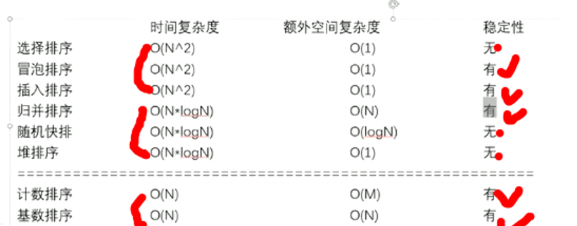

# 二叉树的层序遍历
* 102.二叉树的层序遍历
* 107.二叉树的层次遍历II
* 199.二叉树的右视图
* 637.二叉树的层平均值
* 429.N叉树的前序遍历
* 515.在每个树行中找最大值
* 116.填充每个节点的下一个右侧节点指针
* 117.填充每个节点的下一个右侧节点指针II
* 104.二叉树的最大深度
* 111.二叉树的最小深度

# 时间复杂度

* 插入排序（o(n^2)）【当数据量小时，这个方法简单】【稳定】、
* 堆排序o(nlog(n))【不稳定】、
* 归并排序o(nlog(n))【稳定】，
* 快速排序o(nlog(n))（虽然快排不稳定，但是很多不需要稳定情况下，快排非常快）
* 二分法o(logn)

