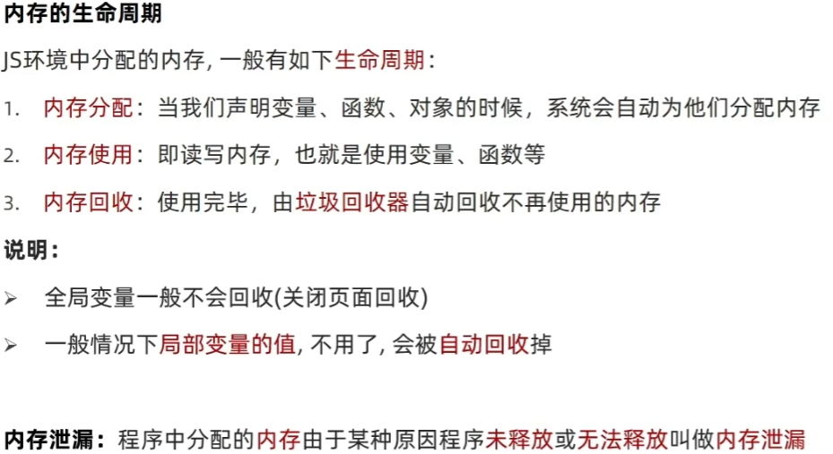
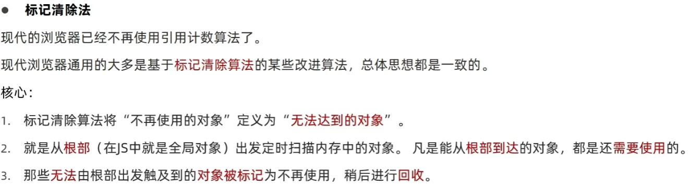
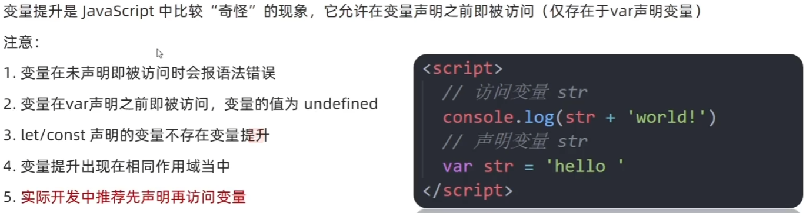

# 局部作用域
let const 有块级作用域\
var没有块级作用域
# 全局作用域
 
 script标签内部\
 .js文件

# 作用域链
作用域链的本质上是底层的变量查找机制。\
规则：
    在函数被执行时，会优先查找当前函数作用域中查找变量\
    如果当前作用域查找不到则会依次查找父级作用域直到全局作用域\
子作用域可以访问父作用域，父级作用域无法访问子级作用域\

# 垃圾回收机制

算法说明

1、引用标记法

2、标记清除法

# 闭包
概念：一个函数对周围状态的引用捆绑在一起，内层函数中访问到其外层函数的作用域

简单理解：闭包 = 内层函数 + 外层函数的变量

闭包应用：实现数据的私有

闭包可能引起的问题：内存泄露

# 变量提升

 