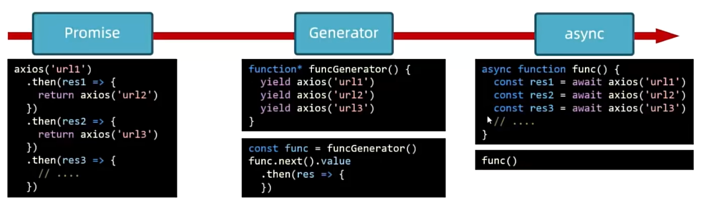

# Generator
Generator函数是ES6提供的一种异步编程解决方案
## Generator核心语法
```js
/**
 * Generator核心语法
 *  1. 定义生成器函数
 *  2. 获取Generator对象
 *  3. next方法
 *  4. for of
*/
//1. 定义生成器函数
function* kkkkGenerator() {
console.log('执行成功')
yield 'kk'
yield 'kirito'
yield 'e7'
}

//2. 获取 Generator对象
const kkkkk = kkkkGenerator();//调用时不会执行函数

// 3.next方法-执行函数
// {value:'yield之后的值',done:false/true}
// done：判断是否执行完毕，false 可以继续执行，true 已经执行完毕
// value：yield之后的值'kk'/'kirito'/'e7'

// 4. for of
for (const iterator of kkkkk) {
console.log(iterator)
}
```
## Generator管理异步
核心步骤：异步操作之前加上yield
