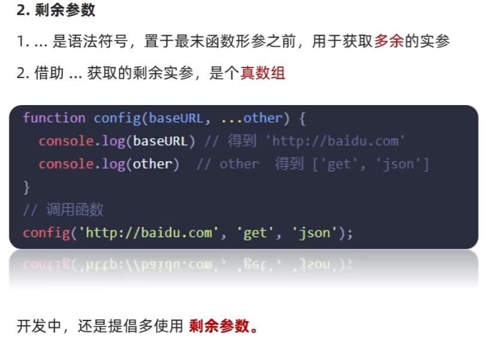
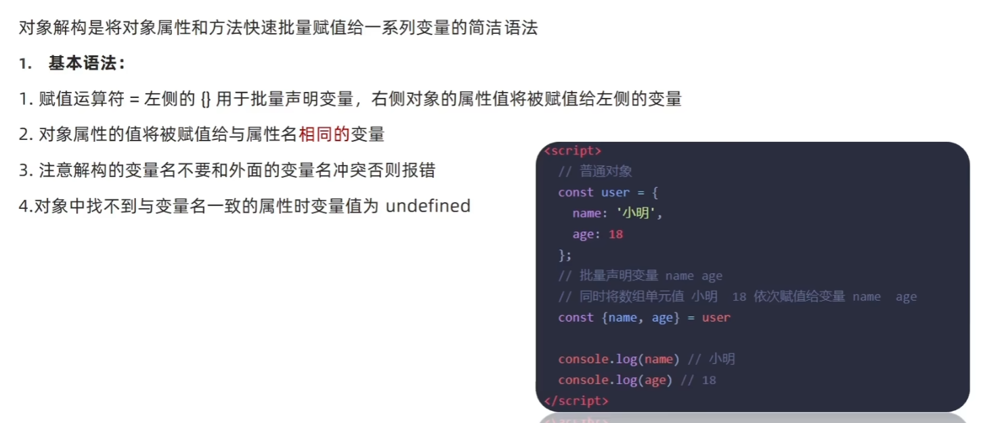

# 函数提升
与变量提升比较类似，是指函数在声明之前即可被调用。

1. 函数提升能使函数的声明调用更加灵活
2. 函数表达式不存在提升的现象
3. 函数提升出现在相同作用域当中

注意：函数表达式 必须先声明和赋值，后调用，否则会报错

# 函数参数
1. 动态参数
arguments是函数内部内置的伪函数变量，它包含了调用函数时传入的所有实参
2. 剩余参数
剩余参数允许我们将一个不定数量的参数表示为一个数组
  

3. 展开运算符(...)
将一个数组进行展开

运用场景：求数组的最大最小值，合并数组等
```js
//求最大值最小值
const arr = [1,,5,7,23,6]
console.log(Math.max(...arr));//23
console.log(Math.min(...arr));//1
//合并数组
const arr1 = [1,2,3];
const arr2 = [4,5,6];
const arr3 = [...arr1,...arr2];
console.log(arr3);//[1,2,3,4,5,6]
```

# 箭头函数

1. 箭头函数没有arguments参数，但是有剩余参数
2. 箭头函数的this 

- 普通函数的this指向的是它的调用者
- 箭头函数不会创建自己的this，它只会从自己的作用域链的上一层沿用this
- 在开发中【使用箭头函数前需要考虑函数中的this的值】，事件回调函数使用箭头函数时，this为全局的window，因此DOM事件回调函数为了简便，还是不太推荐使用箭头函数


# 解构赋值
1. 数组的解构赋值
```js
const arr = [100,80,60];
const [max,mid,min] = arr;

//典型应用：交换两个变量
let a = 1;
let b = 2;
[b,a] = [a,b];
console.log(a,b);//2 1
```
注意：必须加分号的两种情况：
```js
//1. 立即执行函数
(function () { })();
(function () { })();
//2. 使用数组的时候
;array.API()
```
2. 对象的解构赋值

```js
//对象的解构
const obj = {
    uname:'kkk',
    age:18
}

const {uname,age} = obj;
console.log(uname,age);//kkk 18

//对象解构的变量名 可以重新改名 旧变量名:新变量名
const {uname:username,age} = obj;

//解构数组对象
const arr = [
    {
        sname:'帅k',
        sage:19
    }
]

const [{sname,sage}] = arr;
console.log(sname,sage);//帅k 19
