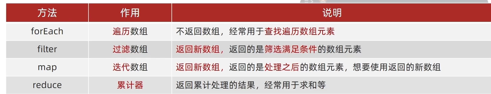
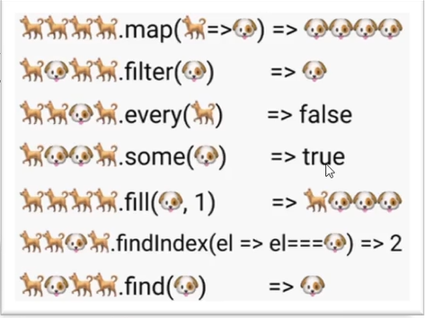
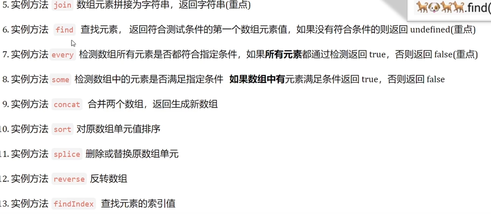
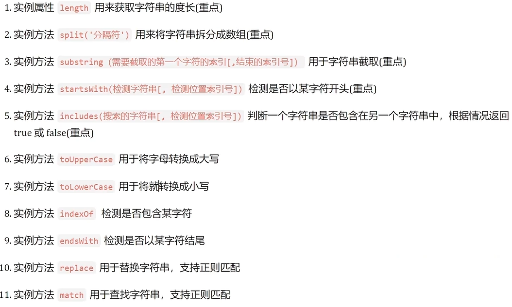

# 对象
创建对象的三种方式

1. 利用对象字面量创建对象
2. 利用new Object创建对象
3. 利用构造函数创建对象

实例化执行过程

1. 创建新的空对象
2. 构造函数this指向新对象
3. 执行构造函数代码，修改this，添加新的属性
4. 返回新对象

### Object的静态方法
1. 获取对象的键，封装成一个数组
`Object.keys()`
2. 常用于对象拷贝  
`Object.assign`

### 数组常见的实例方法  
  
1. reduce
```js
//数组reduce方法
const arr = [1,3,5,7];
//1.没有初始值
const total1 = arr.reduce((prev,current) => {
    return prev + current;
})
console.log(total1)
//2.有初始值
const total2 = arr.reduce((prev,current) => {
    return prev + current
},10)
console.log(total2)
```
2. 数组的其他方法  




find方法
```js
const arr = [
    {
        name:'小米',
        price:1999
    },
    {
        name:'华为',
        price:3999
    }
]

const mi = arr.find((item) => {
    return item.name === '小米'
})
console.log(mi)
```
every方法
```js
const arr = [12,68,23,73,90,22]
const result = arr.every(x => x>= 10)
console.log(result)
```
Array.form(arr)：把伪数组转换为真数组

### 字符串常见实例方法

```js
