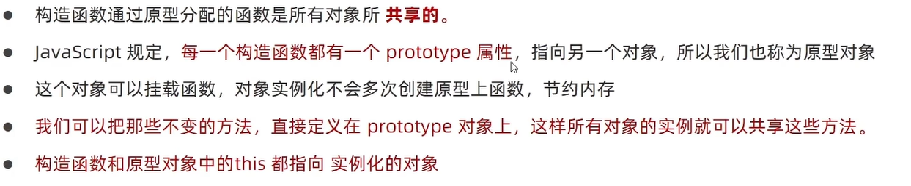
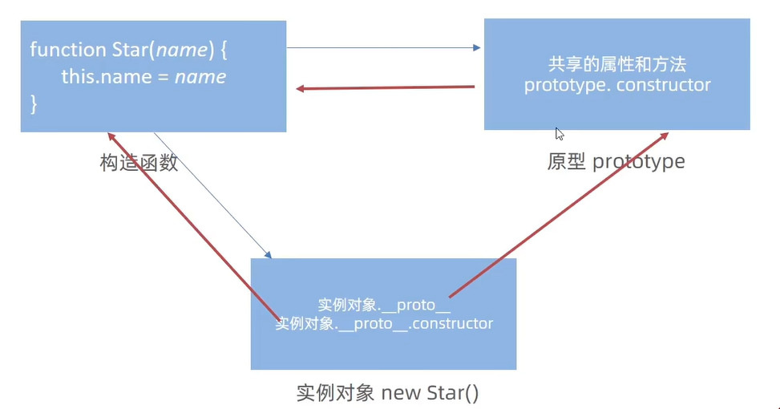
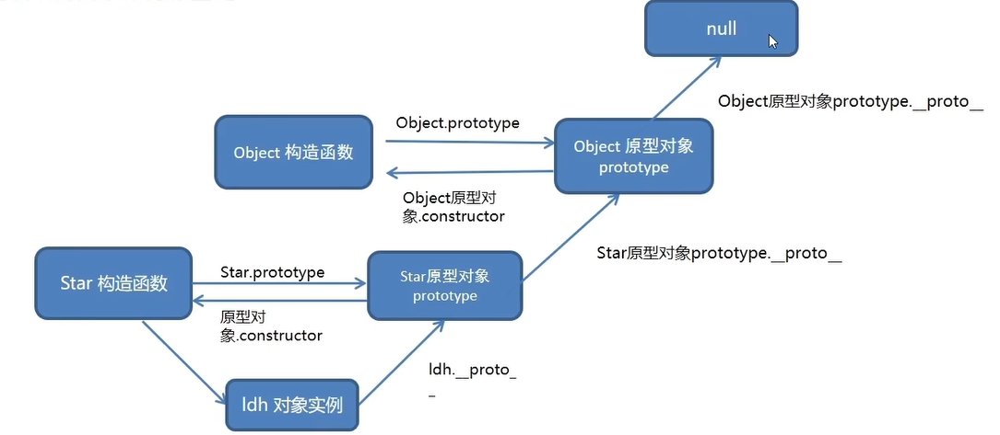
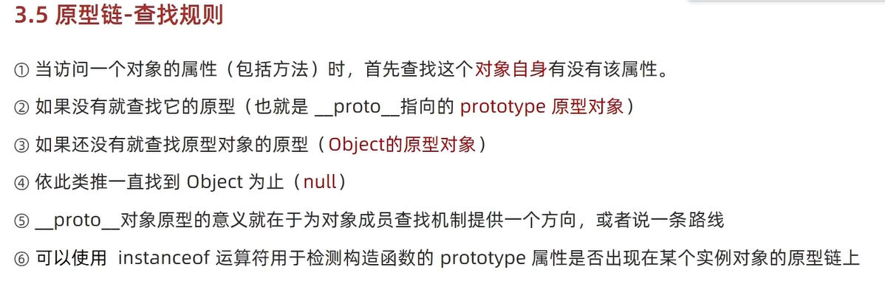

# 编程思想
### 面向过程
面向过程就是分析出解决问题所需要的步骤，然后用函数把这些步骤一步一步实现，使用的时候再一个一个的依次调用就可以了
### 面向对象
面向对象就是把事务分解成一个个对象，然后由对象之间分工与合作

js是典型的面向过程的编程语言

### 构造函数
封装是面向对象思想中比较重要的一部分，js面向对象可以通过构造函数实现的封装。\
这种构造方法很好用，但是存在浪费内存的问题

# 原型
原型是一个对象，我们也称为prototype为原型对象

构造函数和原型对象中的this都指向实例化的对象

### constructor属性
每个原型对象里面都有个constructor属性（constructor构造函数）\
作用：该属性指向该原型对象的构造函数\
使用场景：
如果有多个对象的方法，我们可以给原型对象采取对象形式赋值.\
但是这样就会覆盖构造函数原型对象原来的内容，这样修改后的原型对象constructor 就不再指向当前构造函数了\
此时，我们可以在修改后的原型对象中，添加一个 constructor 指向原来的构造函数
```js
function Star(name) {
    this.name = name;
}
Star.prototype = {
    //手动利用constructor 指向构造函数
    constructor:Star,
    sing:function() {console.log('唱歌')},
    dance:function() {console.log('跳舞')}
}
console.log(Star.prototype.constructor);//指向Star
```
### 对象原型
对象都会有一个属性_proto_指向构造函数的prototype原型对象，之所以我们对象可以使用构造函数prototype原型对象的属性和方法，就是因为对象有_proto_原型的存在

```js
function Star() { }
const zjl = new Star();
//对象原型__proto__指向 该构造函数的原型对象
console.log(zjl.__proto__ === Star.prototype); // true
//对象原型里面有constructor 指向构造函数Star
console.log(zjl.__proto__.constructor === Star); // true
```


### 原型继承
继承是面向对象编程的另一个特征，通过继承进一步提升代码封装的程度，javaScript中大多是借助原型对象实现继承的特性\
需求：男人和女人不要使用同一个对象，但是不同对象里面包含相同的属性和方法\
答案：构造函数  new每次都会创建一个新的对象
```js
//构造函数  new 出来的对象  结构一样，但是对象不一样
        function Person() {
            this.eyes = 2,
            this.head = 1
        }

        //女人，构造函数，继承Person
        function Women() {

        }
        //父构造函数（父类）  子构造函数（子类）
        //子类的原型 = new 父类
        //Women通过原型来继承Person
        Women.prototype = new Person()
        //指回原来的构造函数
        Women.prototype.constructor = Women
        const alice = new Women()
        //给女生添加一个方法生孩子
        Women.prototype.baby = function() {
            console.log('宝贝')
        }
        console.log(alice)
        console.log(Women.prototype)

        //男人 ，构造函数，继承Person
        function Man() {

        }
        //通过原型继承Person
        Man.prototype = new Person()
        Man.prototype.constructor = Man
        const cxk = new Man()
        console.log(cxk)
        console.log(Man.prototype)
```

### 原型链
基于原型对象的继承使得不同构造函数的原型对象关联在一起，并且这种关联的关系是一种链状的结构，我们将原型对象的链状结构关系称为原型链




原型链其实是一种查找规则

```js
// console.log(Object.prototype)
console.log(Object.prototype.__proto__)// null
function Person() {

}
const cxk = new Person()
console.log(cxk.__proto__ === Person.prototype)//true
console.log(Person.prototype.__proto__ === Object.prototype)//true
console.log(cxk instanceof Person)//true
console.log(cxk instanceof Object)//true
console.log(cxk instanceof Array)//false
console.log([1,2,3] instanceof Array)//true
console.log(Array instanceof Object)//true

```
