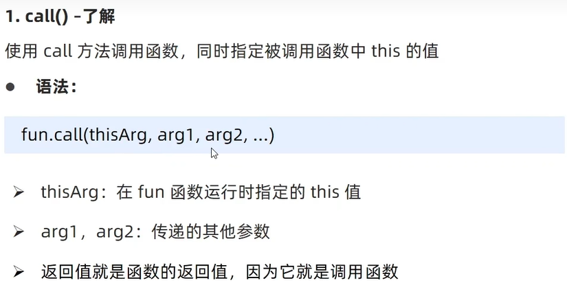
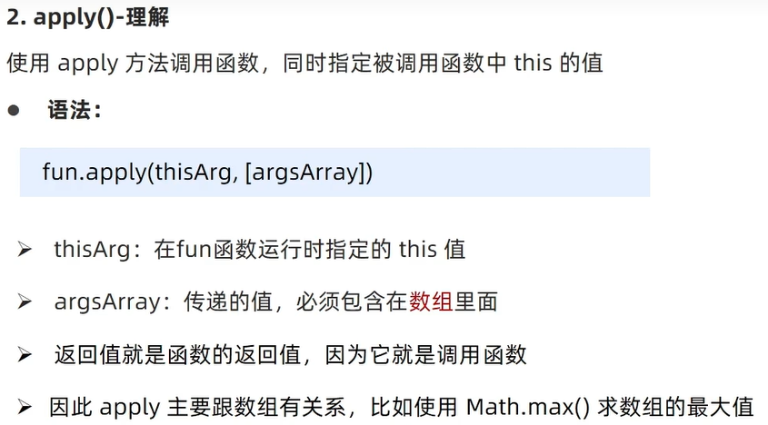
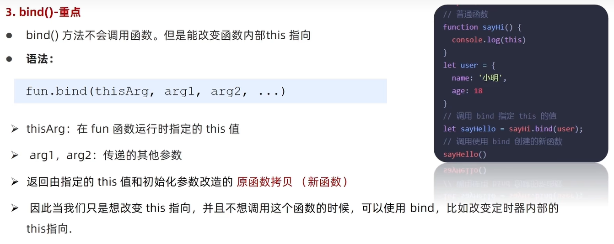
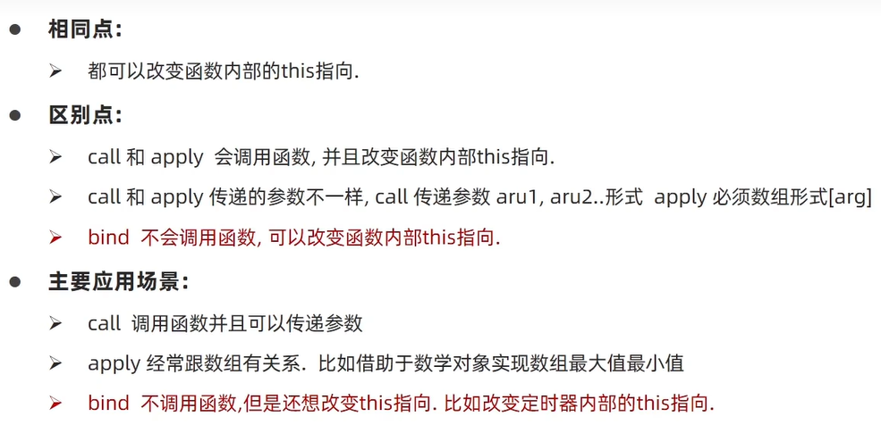

# 深浅拷贝
开发中我们经常需要复制一个对象。如果直接用赋值就会有下面的问题\
直接赋值是直接拷贝对象栈里面的地址
```js
const Person = {
    name:'kkkk',
    age:20
}
const ke = Person
console.log(ke)// {name: 'kkkk', age: 20}
ke.age = 18
console.log(ke)// {name: 'kkkk', age: 18}
//但是Person对象里面的age值也发生了变化
console.log(Person)// {name: 'kkkk', age: 18}
```

首先浅拷贝和深拷贝只针对引用类型
### 浅拷贝
浅拷贝：拷贝的是地址\
拷贝对象之后，里面的属性值是简单数据类型直接拷贝值\
如果属性值是引用数据类型则拷贝的是地址
#### 常见方法：
1. 拷贝对象：Object.assign() | 展开运算符 { ...obj }拷贝对象
2. 拷贝数组：Array.prototype.concat() 或者 [...arr]
```js
// 拷贝对象
const Person = {
    name:'kkkk',
    age:20
}
//1、展开运算符赋值
const ke = { ...Person }
console.log(ke)// {name: 'kkkk', age: 20}
ke.age = 18
console.log(ke)// {name: 'kkkk', age: 18}
console.log(Person)// {name: 'kkkk', age: 20}

//2、Object.assign方法
const ke = {}
Object.assign(ke,Person)
console.log(ke)// {name: 'kkkk', age: 20}
ke.age = 18
console.log(ke)// {name: 'kkkk', age: 18}
console.log(Person)// {name: 'kkkk', age: 20}
```
#### 但是还有问题：
如果是简单数据类型拷贝值，引用数据类型拷贝的是地址（简单理解：如果是单层的对象，没有问题，如果有多层就有问题）
```js
const Person = {
    name:'kkkk',
    age:20,
    hobby:{
        game:'王者荣耀'
    }
}
const ke = {}
Object.assign(ke,Person)
console.log(ke)
//更改对象里面的hobby还是会有影响
ke.hobby.game = '蛋仔派对'
console.log(ke)
console.log(Person)
```
### 深拷贝
深拷贝：拷贝的是对象，不是地址
#### 常见方法
1. 通过递归实现深拷贝
```js
const obj = {
    uname:'kkkk',
    age:20,
    game:['王者荣耀','蛋仔派对'],
    hobby:{
        yule:'刷抖音'
    }
}
//递归函数实现深拷贝
function deepCopy(newObj,oldObj) {
    for(let k in oldObj){
        //k表示属性名
        if(oldObj[k] instanceof Array){
            //处理数组的问题——注意：一定要先判断数组，在判断对象（因为Array instanceof Object）
            newObj[k] = []
            deepCopy(newObj[k],oldObj[k])
        }else if(oldObj[k] instanceof Object){
            //处理对象问题‘
            newObj[k] = {}
            deepCopy(newObj[k],oldObj[k])
        }else{
            newObj[k] = oldObj[k]
        }
    }
}
const o = {}
deepCopy(o,obj)
o.game[0] = '第五人格'
o.hobby.yule = '看小说'
console.log(o)
console.log(obj)
```
2. js库中的lodash里面的cloneDeep内部实现了深拷贝
```js
//js库中的lodash里面的cloneDeep内部实现了深拷贝
var _ = require('lodash');
const o = _.cloneDeep(obj)
o.game[0] = '第五人格'
o.hobby.yule = '看小说'
console.log(o)
console.log(obj)
```
3. 通过JSON.stringify()实现
```js
const o = JSON.parse(JSON.stringify(obj))
o.game[0] = '第五人格'
o.hobby.yule = '看小说'
console.log(o)
console.log(obj)
```

# 异常处理

# 处理this
### 改变this指向
JavaScript中还允许指定函数中this的指向，有三个方法可以动态指定普通函数中this的指向\
#### 1.call()

```js
const obj = {
    uname:'kkkk'
}
function fn(x,y){
    console.log(this);
    console.log(x + y);//3
}
//1.调用函数
//2.改变this指向
fn.call(obj,1,2)
```
#### 2.apply()

```js
function fn(x,y){
    console.log(this);
    console.log(x + y);//3
}
//1.调用函数
//2.改变this指向
fn.apply(obj,[1,2]);
//3. 返回值  本身就是在调用函数，所以返回值就数的返回值
//使用场景：求数组最大值
const arr = [100,44,77];
const max = Math.max.apply(Math,arr);
console.log(max);//100
```
### 3.bind()

```js
function fn(){
    console.log(this);
}
//1.bind 不会调用函数
//2.改变this指向
//3.返回值是一个函数，但是这个函数里面的this是更改过的
const fun = fn.bind(obj);
// console.log(fun);//fun是个函数
fun();// {uname: 'kkkk'}

//需求：有一个按钮，点击立马就禁用，2秒钟之后就开启
const btn = document.querySelector('button')
btn.addEventListener('click',function() {
    //禁用按钮
    this.disabled = true;
    //常规使用定时器，这里的this指向的是window
    /* setTimeout(function() {
        this.disabled = false;
    },2000) */
    setTimeout(function() {
        //在这个普通函数里面，我们要将this由的指向window改为btn
        this.disabled = false;
    }.bind(this),2000)//这里的this就是btn
    //当然箭头函数也能解决这个问题
    setTimeout(() => {
        this.disabled = false
    },2000)
})
```
## call apply bind 总结



