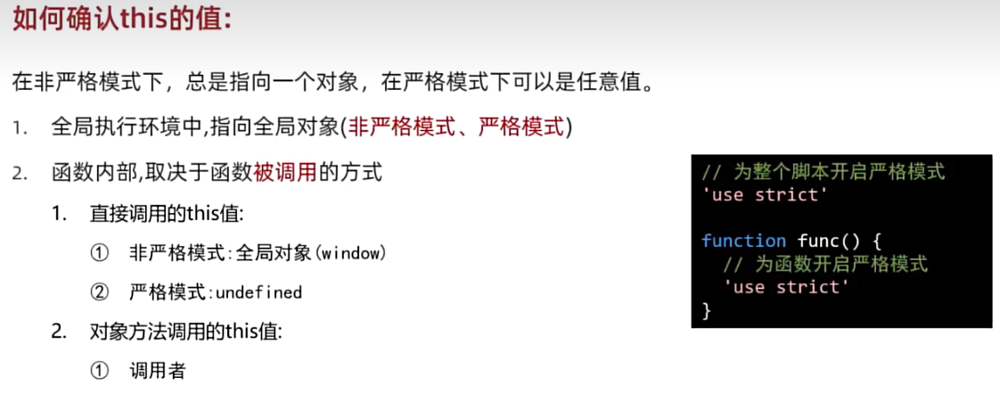

# 如何确认this的值

```js
// -------------1.全局执行环境----------------
// 严格模式，非严格模式 全局对象（window）
'use strict'
console.log(this);

// -------------2.函数内部----------------
// 2.1 直接调用-非严格模式
function func() {
    console.log(this);// window
}
func();
// 2.1 直接调用-严格模式
function func() {
    'use strict'
    console.log(this);// undefined
}
func();

// 2.2 对象方法调用
const food = {
    name:'黄焖鸡米饭',
    eat() {
        'use strict'
        console.log(this);
    }
}
//严格模式、非严格模式
food.eat();//调用者
```
# 如何指定this的值
### 可以通过两类方法指定this：
#### 1. 调用时指定：
1. call方法
2. apply方法
#### 2. 创建时指定：
1. bind方法
2. 箭头函数

# 手写call、apply、bind：
## 手写call
```js
/**
 * 手写call方法
 * 1. 定义myCall方法
 * 2. 设置this并调用原函数
 * 3. 接收剩余参数并返回结果
 * 4. 使用Symbol调优
*/
// 1. 定义myCall方法
Function.prototype.myCall = function(thisArg,...args) {
    //2. 设置this并调用原函数
    // thisArg 传入的设置为this的对象
    // this 原函数（原函数.myCall）
    /* thisArg.f = this;
    //3. 接收剩余参数并返回结果
    const res = thisArg.f(...args);
    //删除添加的函数
    delete thisArg.f;
    return res; */

    // 4. 使用Symbol调优
    // 给thisArg加一个一定和原属性不重名的新属性（方法）
    const key = Symbol('key');
    //thisArg.key
    thisArg[key] = this;
    const res = thisArg[key](...args);
    delete thisArg[key];
    return res;
}
```
## 手写apply
```js
/**
    * 手写apply方法
    * 1. 定义myApply方法
    * 2. 设置this并调用原函数
    * 3. 接收剩余参数并返回结果
*/
// 1. 定义myApply方法
Function.prototype.myApply = function(thisArg,args) {
    const key = Symbol('key');
    thisArg[key] = this;
    const res = thisArg[key](...args);
    delete thisArg[key];
    return res;
}

```

## 手写bind
```js
/**
    * 手写bind方法
    * 1. 定义myBind方法
    * 2. 返回绑定this的新函数
    * 3. 合并绑定和新传入的参数
*/
// 1. 定义myBind方法
Function.prototype.myBind = function(thisArg,...args) {
    // 2. 返回绑定this的新函数
    // reArgs：返回的函数传入的参数
    return (...reArgs) => {
        // this：原函数（原函数.myBind）
        return this.call(thisArg,...args,...reArgs)
    }
}
```

