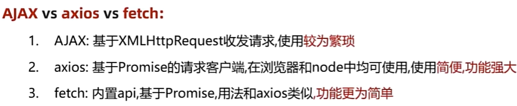

# fetch
fetch:fetch是浏览器内置的api，用于发送网络请求\

### fetch核心语法
```js
/**
 * fetch核心语法
 *  1. 如何发请求？
 *  2. 如何处理响应（JSON）？
 *  3. 如何处理异常？
*/
document.querySelector('.btn').addEventListener('click',async () => {
    const p = neURLSearchParams({pname:'四川省',cname:'成都市'})
    // 1. 处理请求，默认是get方法，参数 url地址，返回的Promise
    const res = await fetch('http://hmajax.itheima.net/api/area?'+p.toString())
    console.log(res)

    if(res.status >= 200 && res.status < 300) {
        //2.处理响应（JSON）.json方法
        const data = await res.json()
        console.log(data)                
    } else {
        // 3. 处理异常
        console.log('请求异常',res.status)
    }
})
```
### fetch提交FormData
```js
/**
 * fetch提交FormData
 *  1.如何设置请求方法？
 *  2.如何提交数据？
*/
document.querySelector('.ipt').addEventListener('change',async function() {
const img = this.files[0]
const data = new FormData()
data.append('img',img)
const res = await fetch('http://hmajax.itheima.net/api/uploadimg',{
    //设置请求方法
    method:'post',
    // 提交的数据
    body:data
})
const resData = await res.json()
console.log(resData)

//回显
document.querySelector('.icon').src = resData.data.url
})
```
### fetch提交JSON
```js
// 实例化Headers对象
const headers = new Headers()
// append 添加keyvalue
headers.append('content-type','application/json')
const res = await fetch('http://hmajax.itheima.net/api/register',{
    method:'post',
    headers,
    //JSON.stringify  对象-->JSON
    body: JSON.stringify({
        username:'kkkkkkkk',
        password:'123456'
    })
})
//res.status 判断状态码
const data = await res.json()
console.log(data)
```