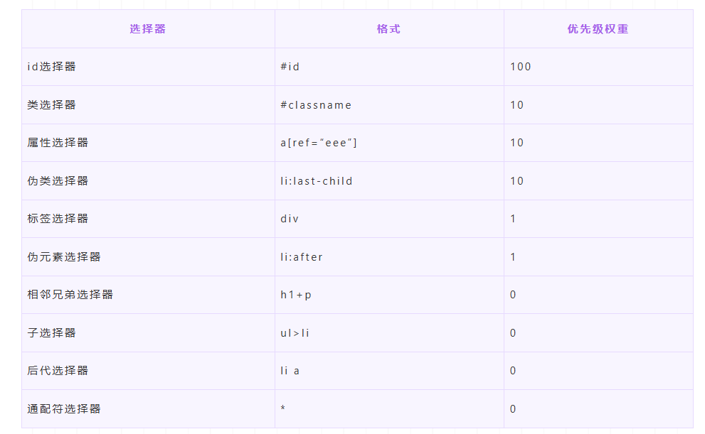
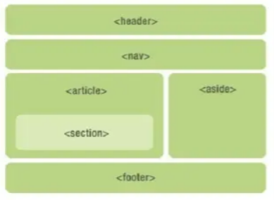

# HTML5
1. src和href的区别
   + src：表示对资源的引用，它指向的内容会嵌入到当前标签所在的位置。src会将其指向的资源下载并应⽤到⽂档内，如请求js脚本。
   + href：表示超文本引用，它指向一些网络资源，建立和当前元素或本文档的链接关系。

2. 对HTML语义化的理解：根据内容的结构化（内容语义化），选择合适的标签（代码语义化）。
   优点：
      + 对机器友好，带有语义的文字表现力丰富，更适合搜索引擎的爬虫爬取有效信息，有利于SEO。除此之外，语义类还支持读屏软件，根据文章可以自动生成目录；
      + 对开发者友好，使用语义类标签增强了可读性，结构更加清晰，开发者能清晰的看出网页的结构，便于团队的开发与维护。
    常见的语义化标签：
    ```html
    <header></header>  头部

    <nav></nav>  导航栏

    <section></section>  区块（有语义化的div）

    <main></main>  主要区域

    <article></article>  主要内容

    <aside></aside>  侧边栏

    <footer></footer>  底部
    ```
3. DOCTYPE（文档类型）的作用
   DOCTYPE是HTML5中一种标准通用标记语言的文档类型声明，它的目的是告诉浏览器（解析器）应该以什么样（html或xhtml）的文档类型定义来解析文档，不同的渲染模式会影响浏览器对 CSS 代码甚⾄ JavaScript 脚本的解析。它必须声明在HTML⽂档的第⼀⾏。
4. script标签中defer和async的区别
   如果没有defer或async属性，浏览器会立即加载并执行相应的脚本。它不会等待后续加载的文档元素，读取到就会开始加载和执行，这样就阻塞了后续文档的加载。
   defer和async属性都是去异步加载外部的JS脚本文件，他们都不会阻塞页面的解析
   区别如下：
    + 执行顺序：多个带async属性的标签，不能保证加载的顺序；多个带defer属性的标签，按照加载顺序执行；
    + 脚本是否并行执行：async属性，表示后续文档的加载和执行与js脚本的加载和执行是并行进行的，即异步执行；defer属性，加载后续文档的过程和js脚本的加载(此时仅加载不执行)是并行进行的(异步)，js脚本需要等到文档所有元素解析完成之后才执行，DOMContentLoaded事件触发执行之前。

5. 常用的媒体标签
6. HTML5有哪些更新：
   1. 语义化标签
   2. 媒体标签
   3. 表单
   4. 进度条、度量器
   5. DOM查询操作
   6. Web存储
   7. 其他
   总结：
    （1）新增语义化标签：nav、header、footer、aside、section、article
    （2）音频、视频标签：audio、video
    （3）数据存储：localStorage、sessionStorage
    （4）canvas（画布）、Geolocation（地理定位）、websocket（通信协议）
    （5）input标签新增属性：placeholder、autocomplete、autofocus、required
    （6）history API：go、forward、back、pushstate
7. img的srcset属性的作用
   响应式页面中经常用到根据屏幕密度设置不同的图片。img的srcset属性就用于设置不同的图片密度下，img自动加载不同的图片
8. 行内元素有哪些？块级元素有哪些？空（void）元素有哪些？
9. web worker
    在HTML页面中，如果执行脚本时，页面的状态是不可响应的，直到脚本执行完成后，页面才变成可响应的。web worker是运行在后台的js，独立于其他脚本，不会影响页面的性能。并且通过postMessage将结果回传到主线程。这样在进行复杂的操作的时候就不会阻塞主线程了。
    如何创建web worker：
    1. 检测浏览器对于web worker的支持性
    2. 创建web worker文件（js，回传函数等）
    3. 创建web worker 对象
10. HTML5的离线储存怎么使用，它的工作原理是什么
11. 浏览器如何对HTML5的离线储存资源进行管理和加载？
12. title与h1的区别、b与strong的区别、i与em的区别？
13. iframe有哪些优缺点？
    iframe元素会创建包含另一个文档的内联框架（即行内框架） 
    优点：
    + 用来加载速度较慢的内容（如广告）
    + 可以使脚本可以并行下载
    + 可以实现跨子域通信
    缺点：
    + iframe 会阻塞主页面的 onload 事件
    + 部分使用会引起跨域
    + 无法被一些搜索引擎索识别
    + 会产生很多页面，不容易管理

14. lable的作用是什么？如何使用？
    lable标签用来定义表单控件的关系：当用户选择label标签时，浏览器会自动将焦点转到和label标签相关的表单控件上。

15. Canvas和SVG的区别
    SVG: 可缩放矢量图形（Scalable Vector Graphics）是基于可扩展标记语言XML描述的2D图形的语言，SVG基于XML就意味着SVG DOM中的每个元素都是可用的，可以为某个元素附加Javascript事件处理器。在 SVG 中，每个被绘制的图形均被视为对象。如果 SVG 对象的属性发生变化，那么浏览器能够自动重现图形。
    + 特点:
    + 不依赖分辨率
    + 支持事件处理器
    + 最适合带有大型渲染区域的应用程序（比如谷歌地图）
    + 复杂度高会减慢渲染速度（任何过度使用 DOM 的应用都不快）
    + 不适合游戏应用 
    Canvas: 画布，通过Javascript来绘制2D图形，是逐像素进行渲染的。其位置发生改变，就会重新进行绘制。
    + 特点：
    + 依赖分辨率
    + 不支持事件处理器
    + 弱的文本渲染能力
    + 能够以 .png 或 .jpg 格式保存结果图像
    + 最适合图像密集型的游戏，其中的许多对象会被频繁重绘
    > 矢量图，也称为面向对象的图像或绘图图像，在数学上定义为一系列由线连接的点。矢量文件中的图形元素称为对象。每个对象都是一个自成一体的实体，它具有颜色、形状、轮廓、大小和屏幕位置等属性。


1.  head标签有什么用？其中什么标签必不可少
    + head标签用于定义文档的头部，它是所有头部元素的容器。`<head>`中的元素可以引用脚本、指示浏览器在哪里找到样式表、提供元信息等。
    + 文档的头部描述了文档的各种属性和信息，包括文档的标题、在 Web 中的位置以及和其他文档的关系等。绝大多数文档头部包含的数据都不会真正作为内容显示给读者。
    + 这些标签可用在 head 部分：`<base>,<link>,<style>,<script>,<meta>,<title>`,其中`<title>`定义文档的标题，它是head中唯一必须的元素。
2.  文档声明（Doctype）和`<!Doctype html>`有何作用? 严格模式与混杂模式如何区分？它们有何意义?
3.  浏览器乱码的原因是什么？如何解决？
      + 产生乱码的原因：
        + 网页源代码是gbk的编码，而内容中的中文字是utf-8编码的，这样浏览器打开即会出现html乱码，反之也会出现乱码；
        + html网页编码是gbk，而程序从数据库中调出呈现是utf-8编码的内容也会造成编码乱码；
        + 浏览器不能自动检测网页编码，造成网页乱码。
      + 解决办法：
        + 使用软件编辑HTML网页内容；
        + 如果网页设置编码是gbk，而数据库储存数据编码格式是UTF-8，此时需要程序查询数据库数据显示数据前进程序转码；
        + 如果浏览器浏览时候出现网页乱码，在浏览器中找到转换编码的菜单进行转换。
4.   渐进增强和优雅降级之间的区别
    （1）渐进增强：主要是针对低版本的浏览器进行页面重构，保证基本的功能情况下，再针对高级浏览器进行效果、交互等方面的改进和追加功能，以达到更好的用户体验。
    （2）优雅降级： 一开始就构建完整的功能，然后再针对低版本的浏览器进行兼容。

# CSS

## css和js的解析顺序
默认情况下，浏览器会在解析完HTML和CSS后再解析JavaScript
当浏览器遇到 script 标签或者外部 JavaScript 文件（通过 script src="..." 引入）时，会停止解析 HTML，先执行 JavaScript 代码。

## 选择器及其优先级
    
    内联样式>id>类=属性=伪类>标签=伪元素>相邻兄弟=后代=通配符
    > !important声明的样式的优先级最高；
   

## 盒子模型
   盒子模型是用来描述文档元素在页面上所占空间的模型。每个 HTML 元素都被看作一个矩形的盒子，这个矩形包括内容区域、内边距、边框和外边距这四个部分。
   包括四个部分：
   1. 内容区域(content)
   2. 内边距(padding)
   3. 外边距(margin)
   4. 边框(border)

   标准盒子模型和怪异盒子模型：
   在标准盒子模型中，元素的宽度和高度仅包括内容区域（content）的尺寸，不包括内边距（padding）、边框（border）和外边距（margin）。
   在怪异盒子模型中，元素的宽度和高度包括内容区域（content）、内边距（padding）和边框（border）的尺寸，而不包括外边距（margin）。
   在css中，可以通过设置box-sizing属性来指定盒子模型的类型：
   ```css
   box-sizing: content-box; 表示使用标准盒子模型。
   box-sizing: border-box; 表示使用怪异盒子模型。
   ```

## CSS布局单位
px：像素（px）是页面布局的基础，一个像素表示终端（电脑、手机、平板等）屏幕所能显示的最小的区域，像素分为两种类型：CSS像素和物理像素
%：百分比（%），当浏览器的宽度或者高度发生变化时，通过百分比单位可以使得浏览器中的组件的宽和高随着浏览器的变化而变化，从而实现响应式的效果。一般认为子元素的百分比相对于直接父元素。
em和rem：
em： 文本相对长度单位。相对于当前对象内文本的字体尺寸。如果当前行内文本的字体尺寸未被人为设置，则相对于浏览器的默认字体尺寸(默认16px)。(相对父元素的字体大小倍数)。
rem： rem是CSS3新增的一个相对单位，相对于根元素（html元素）的font-size的倍数。作用：利用rem可以实现简单的响应式布局，可以利用html元素中字体的大小与屏幕间的比值来设置font-size的值，以此实现当屏幕分辨率变化时让元素也随之变化。
vm/vh:
vw：相对于视窗的宽度，视窗宽度是100vw；
vh：相对于视窗的高度，视窗高度是100vh；
vmin：vw和vh中的较小值；
vmax：vw和vh中的较大值；


## BFC
   BFC，即块级格式化上下文，它是页面中的一块渲染区域，并且有一套属于自己的渲染规则。它是页面上隔离的独立的容器，容器里面的子元素不会影响到外面的元素，反之，BFC目的是形成相对于外界完全独立的空间，让内部的子元素不会影响到外部的元素
   触发条件
   根元素，即HTML元素
   浮动元素：float值为left，right
   overflow的值不为visible，为auto，scroll，hidden
   display的值为table、inline-block、inline-cell、table-caption、inline-table、flex、inline-flex、grid、inline-grid
   position的值为absolute或者fixed

   清除浮动最好的方法就是使用clearfix。
   clearfix 是一种技术，可以确保包含浮动元素的容器正常显示，而不会受到浮动元素影响导致高度塌陷的问题。

## flex

是以下三个元素的简写：

1. flex-grow：默认值为0，指定弹性子元素的放大比例
2. flex-shrink：默认值为1，指定弹性子元素的收缩比例
3. flex-basis：默认值为auto，指定弹性子元素在没有剩余空间时的基础大小

### flex: 1, flex: 0, flex: auto之间的区别

+ flex: 1  等效于 flex: 1 1 0;
  + flex-grow: 1：元素可以扩展以填满容器中的剩余空间。
  + flex-shrink: 1：元素可以缩小，以避免溢出容器。
  + flex-basis: 0%：元素的初始尺寸为 0%，然后依据 flex-grow 和 flex-shrink 进行调整。
+ flex: 0  等效于 flex: 0 0 auto;
  + flex-grow: 0：元素不会扩展以填满容器中的剩余空间。
  + flex-shrink: 0：元素不会缩小，即使容器空间不足也不会改变大小。
  + flex-basis: auto：元素的初始尺寸由其内容或设置的宽度/高度决定。。
+ flex: auto  等效于 flex: 1 1 auto;
  + flex-grow: 1：元素可以扩展以填满容器中的剩余空间。
  + flex-shrink: 1：元素可以缩小以适应容器的变化。
  + flex-basis: auto：元素的初始尺寸由其内容或设置的宽度/高度决定。

#### 总结
+ `flex: 1`：元素可以扩展和缩小以填满容器的剩余空间，初始尺寸为 0。
+ `flex: 0`：元素不会扩展或缩小，保持其原始尺寸。
+ `flex: auto`：元素可以扩展和缩小，其初始尺寸由内容决定。

## position的属性值
   1. static（静态定位）：元素的默认定位方式，即元素在正常文档流中的位置，不受 top、right、bottom、left 和 z-index 属性的影响。
   2. relative（相对定位）：相对于元素自身原本在文档流中的位置进行定位，通过设置 top、right、bottom、left 属性来调整位置，不会脱离文档流，周围的元素仍会占据原本的位置。
   3. absolute（绝对定位）：相对于最近的已定位祖先元素（非 static 定位）进行定位，如果没有已定位的祖先元素，则相对于初始包含块（通常是 <html> 元素）。绝对定位的元素会脱离文档流，不影响周围元素的布局。
   4.  fixed（固定定位）：相对于视口（viewport）进行定位，固定在屏幕上的位置，不会随页面滚动而移动。
   5.  sticky（粘性定位）：元素在跨越特定阈值前为相对定位，之后为固定定位。通常用于导航栏等元素，在用户滚动页面时保持在某个位置。

   会脱离文档流的属性：absolute、fixed、sticky

## 响应式设计的概念及基本原理
   响应式网站设计是一种网络页面设计布局，页面的设计与开发应当根据用户行为以及设备环境（系统平台、屏幕尺寸、屏幕定向等）进行相应的响应和调整
   响应式设计的基本原理是通过媒体查询（@media）检测不同的设备屏幕尺寸做处理，为了处理移动端，页面头部必须有meta声明viewport
   ```html
   <meta name="’viewport’" content="”width=device-width," initial-scale="1." maximum-scale="1,user-scalable=no”"/>
   ```
   适配方案
   1. 使用css的媒体查询@media
   2. 使用rem单位
   3. flexible适配方案
   4. viewport适配方案


## 元素实现水平垂直居中的方法
   实现方式-块级元素
   1. 利用定位+margin: auto;
   父元素设置为相对定位，子元素设置为绝对定位，并且定位属性都设为0(top,bottom,left,right)
   如果子元素没有设置宽高，那么它就会被拉开到父元素一样的宽高
   如果子元素设置了宽高，所以宽高就会按照我们的设置来显示，实际上虚拟占位已经撑满了整个父级，这个时候给它来个margin: auto;就可以上下左右居中了
   2. 利用定位+margin: 负值;（需要知道子元素的宽高）
   设置父元素为相对定位，子元素为绝对定位。
   子元素的top:50%;left:50%;
   margin-left:-子元素宽度的一半;margin-top:-子元素高度的一半;
   3. 利用定位+transform（不知道子元素的宽高）
   父元素开启相对定位，子元素开启绝对定位
   子元素的top:50%;left:50%;transform:translate(-50%,-50%);
   4. 利用flex布局
   父元素设置：
   display:flex;
   justify-content: center;
   align-items: center;

   实现方式-行内元素
   水平居中：text-align: center;
   垂直居中：line-height: 父元素高度

## 如何实现两栏布局
   两栏布局往往是以一个定宽栏和一个自适应栏并排展示
   实现思路：
   1. 使用float左浮左边框，右面模块使用margin-left撑出内容块做内容展示，为父级元素添加BFC，防止高度塌陷
   2. flex弹性布局
   ```html
   <style>
    .box{
    display: flex;
    }
    .left {
    width: 100px;
    }
    .right {
    flex: 1;
    }
   </style>
   <div class="box">
    <div class="left"> </div>
    <div class="right"> </div>
   </div>
   ```
   flex是最好的方案来实现两栏布局
   注意的是，flex容器的一个默认属性值：align-items:stretch
   这个属性导致了列等高的效果，为了让两个盒子的高度自动，需要设置：align-items:flex-start

## 三栏布局
    1.  两边使用absolute，中间使用margin
    基于绝对定位的三栏布局：注意绝对定位的元素脱离文档流，相对于最近的已经定位的祖先元素进行定位，无需考虑HTML中结构的顺序
    实现流程
    左右两边使用绝对定位，固定在两侧
    中间占满一行，但通过margin在左右两边留出相应的间隙
    main需要设置高度
    ```html
    <style>
    .container {
     position: relative;
     }
     
     .left,
     .right,
     .main {
     height: 200px;// main需要设置高度
     }
     .left {
     position: absolute;
     top: 0;
     left: 0;
     width: 100px;
     background: green;
     }
     .right {
     position: absolute;
     top: 0;
     right: 0;
     width: 100px;
     background: green;
     }
     .main {
     margin: 0 110px;
     background: black;
     }
    </style>
    <div class="container">
     <div class="left"> </div>
     <div class="right"> </div>
     <div class="main"> </div>
    </div>
    ```
    2. 使用flex实现
    ```html
    <style>
       .wrap {
           display: flex;
           justify-content: space-between;
       }
       .left,
       .right,
       .middle {
           height: 100px;
       }
       .left {
           width: 200px;
           background: coral;
       }
       .right {
           width: 120px;
           background: lightblue;
       }
       .middle {
           background: #555;
           flex:1;
           margin: 0 20px;
       }
    </style>
    <div class="wrap">
     <div class="left"> </div>
     <div class="middle"> </div>
     <div class="right"> </div>
    </div>
    ```
    实现过程：
    左右两端对齐，将中间元素设置成flex:1（设置width:100%会改变左右两侧宽度）,即可填充空白
    盒内元素的高度撑开容器的高度

## 弹性布局：
Flex是FlexibleBox的缩写，意为"弹性布局"，用来为盒状模型提供最大的灵活性。任何一个容器都可以指定为Flex布局。行内元素也可以使用Flex布局。注意，设为Flex布局以后，子元素的float、clear和vertical-align属性将失效。
采用Flex布局的元素，称为Flex容器，  它的所有子元素自动成为容器成员，称为Flex项目，容器默认存在两根轴：水平的主轴（main axis）和垂直的交叉轴（cross axis），项目默认沿水平主轴排列。 
在弹性布局中，子元素的宽度和高度会随着容器的大小动态调整以适应不同的屏幕尺寸。弹性布局非常适用于创建具有不同大小和比例的项目。
其中使用flex: 1 可使项目等分弹性容器中的剩余空间。这意味着该项目将会自动填充弹性容器中未被其他项目占用的空间，并且在空间不足时会等比例缩小，以适应容器大小的变化。

## 清除浮动的方式：
    + 给父元素定义`height`属性
    + 包含浮动元素的父级标签添加`overflow:hidden`或者`overflow:auto`
    + 使用 ::after 伪元素。

+ 使用clear属性清除浮动的原理
  ```css
  .clear::after {
    content: '';
    display: block;
    clear: both;
  }
  ```
  clear属性只有块级元素才有效的，而::after等伪元素默认都是内联水平，这就是借助伪元素清除浮动影响时需要设置display属性值的原因。


##  CSS中隐藏元素的方式
    1. display:none;最常用的方式，元素在页面上将彻底消失
    2. visibility:hidden;从页面上仅仅是隐藏元素，本身占有的空间不会消失
    3. opacity:0;元素不可见，占据空间，可以响应点击事件
    4. 设置height、width属性为0。将元素的盒子属性设置为0，如果元素内有子元素或内容，还应该设置overflow:hidden来隐藏子元素

##  单行文本溢出省略
white-space:nowrap 设置文字在一行显示，不能换行
over-flow:hidden 隐藏超出的文字内容
text-overflow:ellipsis ⽂本溢出时显⽰...

## 回流（重排）和重绘
回流：布局引擎会根据各种样式计算每个盒子在页面上的大小和位置
重绘：当计算好盒模型的位置、大小以及其他属性后，浏览器根据每个盒子的特性进行绘制

回流的触发时机
回流这一阶段主要是计算结点的位置和几何信息，那么当页面布局和几何信息发生变化的时候，就需要回流。
● 添加或删除可见的DOM元素
● 内容发生变化，比如文本变化或图片被一个不同尺寸的图片所替代
● 页面一开始渲染的时候
● 浏览器的窗口尺寸变化（因为回流是根据视口的大小来计算元素的位置和大小的）
还有一些容易忽略的操作：获取一些特定属性的值
> offsetTop、offsetWidth、scrollTop、scrollWidth、clientTop、clientWidth
这些属性有一个共性，就是需要通过即时计算得到。因此浏览器为了获取这些值也会进行回流

重绘触发时机
触发回流一定触发重绘
颜色的修改、文本方向的修改、阴影的修改等操作都回引起重绘行为

一般来说，页面的回流比重绘消耗更高。因为回流涉及重新计算元素的尺寸、位置等属性，并重新布局页面，这是比较昂贵的操作，会消耗更多的 CPU 资源。而重绘只涉及重新绘制页面的视觉部分 ，通常比回流消耗的资源要少一些。所以尽量减少页面的回流，可以提升页面的性能。

### 减少重排重绘的措施

+ 操作DOM时，尽量在低层级的DOM节点进行操作
+ 不要使用`table`布局， 一个小的改动可能会使整个 `table` 进行重新布局
+ 使用CSS的表达式
+ 不要频繁操作元素的样式，对于静态页面，可以修改类名，而不是样式。
+ 使用 `absolute` 或者 `fixed` ，使元素脱离文档流，这样他们发生变化就不会影响其他元素
+ 避免频繁操作 DOM，可以创建一个文档片段`documentFragment`，在它上面应用所有 DOM 操作，最后再把它添加到文档中
+ 将元素先设置`display: none`，操作结束后再把它显示出来。因为在display属性为none的元素上进行的DOM操作不会引发回流和重绘。
+ 将DOM的多个读操作（或者写操作）放在一起，而不是读写操作穿插着写。这得益于浏览器的渲染队列机制。


##  SCSS
    SCSS是Sass的新语法，也被称为SASS3，它是一种强大的预处理器
    1. 变量与计算：SCSS允许使用变量，还支持进行数学计算，直接在代码中计算出像素值和颜色等等
    2. 嵌套规则：在SCSS中跨域嵌套选择器
    3. 混合（Mixins）：SCSS的混合功能允许你定义可重用的样式块并在整个样式表中重复使用这些块，这可以极大地地减少重复代码
    4. 继承：SCC允许一个选择器继承另一个选择器地样式，使用@extend指令
    5. 颜色函数和其他功能：SCSS提供了一系列的内置函数用于处理和操作颜色，列表和地图等数据类型。
    6. 条件语句和循环：SCSS支持使用条件语句和循环
    7. 模块化导入：SCSS支持将样式分割为多个文件，并使用@import指令将它们合到一个主样式表中

    SCSS缺点：
    8. 需要编译：SCSS代码需要编译成CSS代码才能在浏览器中运行。这意味着开发过程中需要配置编译工具，可能会增加一些复杂性
    9. 学习曲线
    10. 过度使用功能：过度使用功能可能会导致样式表变得复杂并且难以维护，例如过度嵌套和复杂的混合继承关系
    11. 性能考虑：由于SCSS需要编译为CSS，因此在开发过程中可能会引入一些额外的编译时间，但是随着工具和技术不断改进，这个问题在逐步解决
    12. 浏览器兼容性

## CSS实现颗粒度

在CSS中，“颗粒度”（granularity）通常指的是控制元素的精细程度或者样式的细节。

1. 细粒度控制元素样式：可以通过各种CSS属性来控制元素的具体样式
2. 媒体查询：可以使用媒体查询来实现响应式设计，从而根据屏幕大小或设备类型调整样式的颗粒度
3. 自定义属性（CSS变量）：CSS变量允许定义可以在整个样式表中重复使用的值，从而方便调整和维护样式
4. 伪类和伪元素：伪类和伪元素允许对元素的不同状态或子部分进行细粒度控制
5. 渐变和变换：使用渐变和变换可以实现复杂的视觉效果和细致的样式调整


##  如果要做优化，CSS提高性能的方法有哪些？
    1.  内联首屏关键CSS
    在打开一个页面，页面首要内容出现在屏幕的时间影响着用户的体验，而通过内联css关键代码能够使浏览器在下载完html后就能立刻渲染
    2. 异步加载CSS
    在CSS文件请求、下载、解析完成之前，CSS会阻塞渲染，浏览器将不会渲染任何已处理的内容。前面加载内联代码后，后面的外部引用css则没必要阻塞浏览器渲染。这时候就可以采取异步加载的方案
    + 使用js将link标签插到head标签的最后
  
    1. 资源压缩
    利用webpack，gulp/grunt，rollup等模块化工具，将css代码进行压缩，使文件变小，大大降低了浏览器的加载时间
    2. 合理使用选择器
    css匹配的规则使从右往左匹配，如果嵌套的层级过多，页面中的元素更多，匹配所要花费的时间代价自然更高，所以
    + 不要嵌套使用过多复杂选择器，最好不要三层以上
    + 使用id选择器就没必要再进行嵌套
    + 通配符和属性选择器效率最低，避免使用
    1. 减少使用昂贵的属性
    在页面发生重绘的时候，昂贵属性如box-shadow / border-radius / filter / opacity / :nth-child 等会降低浏览器的渲染性能
    2. 不要使用@import
    css样式文件有两种引入方式，一种是link，另一种是@import
    @import会影响浏览器的并行下载，使得页面在加载时增加额外的延迟，增添了额外的往返耗时，而且多个@import可能会导致下载顺序混乱
    3. 其他
    + 减少重排操作，以及减少不必要的重绘
    + 了解哪些属性可以继承而来，避免对这些属性重复编写
    + cssSprite（雪碧图），合成所有icon图片，减少了http请求
    + 把小的icon图片转成base64编码
    + css3动画或者过渡尽量使用transform和opacity来实现动画，不要使用left和top属性

##  CSS有哪些常见布局
    1.  静态布局（Float布局）：静态布局以像素作为页面的基本单位，不管浏览器宽度如何变化，始终保持布局的原始大小
    2.  自适应布局：自适应布局又称为响应式布局，可以为不同屏幕分辨率定义不同的布局。它是通过检测视口分辨率大小来改变网页的布局和内容展示方式，从而为用户提供更加舒适的界面和更好的用户体验。其特点是每个屏幕分辨率下面会有一个布局样式，同时屏幕分辨率变化时，页面里的元素大小会发生变化，但布局不会改变
    3.  流式布局（百分比布局）：流式布局是一种随者屏幕的改变而改变的布局方式。其页面的元素宽度按照百分比进行设定，元素的高度和一些其他的属性则使用px来固定。流式布局的特点是随者屏幕的改变，页面的布局没有发生太大变化，页面元素的大小会进行适配调整，不会出现横向滚动条。
    4.  弹性布局（flex布局）：在弹性布局中，子元素的宽度和高度会随着容器的大小动态调整以适应不同的屏幕尺寸。弹性布局非常适用于创建具有不同大小和比例的项目。
    5.  网格布局（Grid布局）：网格布局是一种二维的布局方式，可以同时处理行与列。它允许开发人员将页面分割为多个独立的区域并可以灵活的调整每个区域的大小和位置。网格布局适用于创建复杂的页面布局和设计

##  iframe
    iframe是HTML中的一个元素，用于在当前页面中嵌套另一个独立的 HTML 文档。
    特点：
    1. 独立性：iframe中的内容是独立于父页面的，可以加载其他网页、广告或者第三方组件，避免相互影响。
    2. 实现嵌套：通过iframe可以实现页面的嵌套，将多个页面组合成一个整体展示给用户
    3. 简单易用：使用iframe可以简单快速地实现页面内容嵌套功能，不需要太多的代码。
    特点：
    4. 性能开销：每个 iframe 都是一个独立的文档，会增加页面加载时间和内存消耗。
    5. 样式污染：iframe 中的样式表可能相互干扰，需要特殊处理。
    6. 安全风险：恶意网站可能会使用 iframe 来进行点击劫持或其他安全攻击。
    7. 不利于SEO：搜索引擎可能不会很好地处理 iframe 中的内容，影响 SEO 效果。
    8. 难以调试：iframe 中的内容与主页面内容相互独立，造成在调试时比较困难。

##  语义化（百度等搜索公司，前端和搜索关联的为HTML5的语义化）
    + html5 新增了语义化标签 header、nav、section、aside、footer、aside、article
    
    + div + css能解决布局问题，但是可读性不好，代码不好维护
    + SEO搜索引擎优化
    + 更好地支持各种终端，例如无障碍阅读和有声小说等

##  在CSS中实现模块化
    1.  BEM（Block Element Modifier）：BEM 是一种常用的 CSS 命名约定，它将样式分为块（block）、元素（element）和修饰符（modifier），使得样式更具有结构化和可复用性。
    2.  CSS Modules：CSS Modules 是一种将 CSS 文件转换为局部作用域的方式，它通过给每个模块分配一个唯一的标识符来避免样式冲突，并且可以方便地导出和引入样式。
    3.  CSS-in-JS：使用 CSS-in-JS 库（如Styled Components、Emotion等）可以将 CSS 样式与组件逻辑紧密集成，使得样式更加模块化和组件化。
    4.  预处理器：使用 CSS 预处理器（如Sass、Less等）可以通过变量、嵌套、混合等功能来提高 CSS 的模块化和可维护性。

## 如何修改到第三方UI框架里面的样式
可以通过 global 选择器来覆盖第三方组件内部的样式。这种方法允许你在局部作用域的 CSS 中应用全局样式规则，覆盖第三方库中的样式。

# 解决1px问题

## 什么是1px问题

`1px` 问题指的是：在一些 Retina 屏幕 的机型上，移动端页面的 `1px` 会变得很粗，呈现出不止 `1px` 的效果。原因很简单——CSS 中的 `1px` 并不能和移动设备上的 `1px` 划等号。它们之间的比例关系有一个专门的属性来描述：
```html
window.devicePixelRatio = 设备的物理像素 / CSS像素。
```
打开 Chrome 浏览器，启动移动端调试模式，在控制台去输出这个 `devicePixelRatio` 的值。这里选中 iPhone6/7/8 这系列的机型，输出的结果就是2

这就意味着设置的 1px CSS 像素，在这个设备上实际会用 2 个物理像素单元来进行渲染，所以实际看到的一定会比 1px 粗一些。 

之前的 `1px` 的样式
```css
border:1px solid #333
```

可以先在 JS 中拿到 `window.devicePixelRatio` 的值，然后把这个值通过 JSX 或者模板语法给到 CSS 的 `data` 里，达到这样的效果（这里用 JSX 语法做示范）：

```js
<div id="container" data-device={{window.devicePixelRatio}}></div>
```

然后就可以在 CSS 中用属性选择器来命中 devicePixelRatio 为某一值的情况，
```css
#container[data-device="2"] {
  /* border:0.5px solid #333 */
}
```

## 伪元素先放大后缩小
思路是先放大、后缩小：
在目标元素的后面追加一个 `::after` 伪元素，让这个元素布局为 `absolute` 之后、整个伸展开铺在目标元素上，然后把它的宽和高都设置为目标元素的两倍，`border` 值设为 `1px`。接着借助 CSS 动画特效中的放缩能力，把整个伪元素缩小为原来的 50%。此时，伪元素的宽高刚好可以和原有的目标元素对齐，而 `border` 也缩小为了 `1px` 的二分之一，间接地实现了 `0.5px` 的效果。

```css
#container[data-device="2"] {
    position: relative;
}
#container[data-device="2"]::after{
      position:absolute;
      top: 0;
      left: 0;
      width: 200%;
      height: 200%;
      content:"";
      transform: scale(0.5);
      transform-origin: left top;
      box-sizing: border-box;
      border: 1px solid #333;
    }
}
```


## 使用viewport缩放来解决

对 `meta` 标签中的关键属性下手

```html
<meta name="viewport" content="initial-scale=0.5, maximum-scale=0.5, minimum-scale=0.5, user-scalable=no">
```

这里针对像素比为2的页面，把整个页面缩放为了原来的1/2大小。这样，本来占用2个物理像素的 `1px` 样式，现在占用的就是标准的一个物理像素。根据像素比的不同，这个缩放比例可以被计算为不同的值，用 js 代码实现如下：

```js
const scale = 1 / window.devicePixelRatio;
// 这里 metaEl 指的是 meta 标签对应的 Dom
metaEl.setAttribute('content', `width=device-width,user-scalable=no,initial-scale=${scale},maximum-scale=${scale},minimum-scale=${scale}`);
```
副作用：整个页面被缩放了。这时 `1px` 已经被处理成物理像素大小，这样的大小在手机上显示边框很合适。但是，一些原本不需要被缩小的内容，比如文字、图片等，也被无差别缩小掉了。


