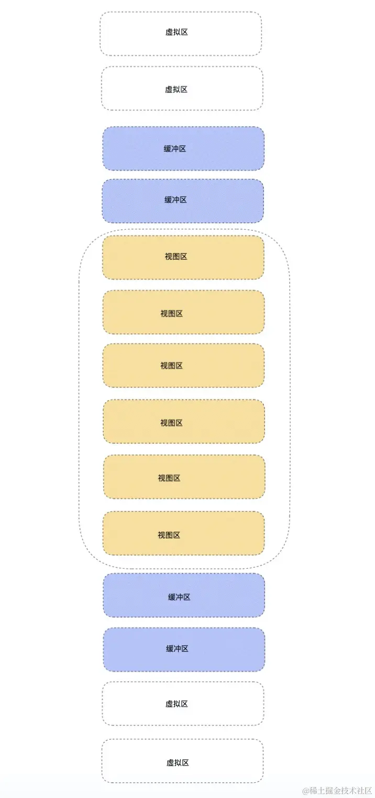

# React 对于大量数据的处理方案

对于项目中大量数据通常存在两种情况：
- 第一种就是数据可视化，比如像热力图，地图，大量的数据点位的情况
- 第二种情况是长列表渲染。

## 时间分片

时间分片主要解决，初次加载，一次性渲染大量数据造成的卡顿现象。

**浏览器执行 js 速度要比渲染 DOM 速度快的多。**

时间分片，并没有本质减少浏览器的工作量，而是把一次性任务分割开来，给用户一种流畅的体验效果。

就像造一个房子，如果一口气完成，那么会把人累死，所以可以设置任务，每次完成任务一部分，这样就能有效合理地解决问题。

## 虚拟列表

虚拟列表是一种长列表的解决方案，现在滑动加载是 M 端和 PC 端一种常见的数据请求加载场景

这种数据交互有一个问题就是，如果没经过处理，加载完成后数据展示的元素，都显示在页面上

如果伴随着数据量越来越大，会使页面中的 DOM 元素越来越多，即便是像 React 可以良好运用 diff 来复用老节点，但也不能保证大量的 diff 带来的性能开销。

所以虚拟列表的出现，就是解决大量 DOM 存在，带来的性能问题。

何为虚拟列表，就是在长列表滚动过程中，只有视图区域显示的是真实 DOM ，滚动过程中，不断截取视图的有效区域，让人视觉上感觉列表是在滚动。达到无限滚动的效果。

虚拟列表划分可以分为三个区域：视图区 + 缓冲区 + 虚拟区。


- 视图区：视图区就是能够直观看到的列表区，此时的元素都是真实的 DOM 元素。
- 缓冲区：缓冲区是为了防止用户上滑或者下滑过程中，出现白屏等效果。(缓冲区和视图区为渲染真实的 DOM)
- 虚拟区：对于用户看不见的区域（除了缓冲区），剩下的区域，不需要渲染真实的 DOM 元素。虚拟列表就是通过这个方式来减少页面上 DOM 元素的数量。

具体实现思路：
- 通过 `useRef` 获取元素，缓存变量
- `useEffect` 初始化计算容器的高度。截取初始化列表长度。这里需要 div 占位，撑起滚动条。
- 通过监听滚动容器的 onScroll 事件，根据 scrollTop 来计算渲染区域向上偏移量, 这里需要注意的是，当用户向下滑动的时候，为了渲染区域，能在可视区域内，可视区域要向上滚动；当用户向上滑动的时候，可视区域要向下滚动。
- 通过重新计算 end 和 start 来重新渲染列表。

```js
function VirtualList(){
   const [ dataList,setDataList ] = React.useState([])  /* 保存数据源 */
   const [ position , setPosition ] = React.useState([0,0]) /* 截取缓冲区 + 视图区索引 */
   const scroll = React.useRef(null)  /* 获取scroll元素 */
   const box = React.useRef(null)     /* 获取元素用于容器高度 */
   const context = React.useRef(null) /* 用于移动视图区域，形成滑动效果。 */
   const scrollInfo = React.useRef({ 
       height:500,     /* 容器高度 */
       bufferCount:8,  /* 缓冲区个数 */
       itemHeight:60,  /* 每一个item高度 */
       renderCount:0,  /* 渲染区个数 */ 
    }) 
    React.useEffect(()=>{
        const height = box.current.offsetHeight
        const { itemHeight , bufferCount } = scrollInfo.current
        const renderCount =  Math.ceil(height / itemHeight) + bufferCount
        scrollInfo.current = { renderCount,height,bufferCount,itemHeight }
        const dataList = new Array(10000).fill(1).map((item,index)=> index + 1 )
        setDataList(dataList)
        setPosition([0,renderCount])
    },[])
   const handleScroll = () => {
       const { scrollTop } = scroll.current
       const { itemHeight , renderCount } = scrollInfo.current
       const currentOffset = scrollTop - (scrollTop % itemHeight) 
       const start = Math.floor(scrollTop / itemHeight)
       context.current.style.transform = `translate3d(0, ${currentOffset}px, 0)` /* 偏移，造成下滑效果 */
       const end = Math.floor(scrollTop / itemHeight + renderCount + 1)
       if(end !== position[1] || start !== position[0]  ){ /* 如果render内容发生改变，那么截取  */
            setPosition([ start , end ])
       }
   } 
   const { itemHeight , height } = scrollInfo.current
   const [ start ,end ] = position
   const renderList = dataList.slice(start,end) /* 渲染区间 */
   console.log('渲染区间',position)
   return <div className="list_box" ref={box} >
     <div className="scroll_box" style={{ height: height + 'px'  }}  onScroll={ handleScroll } ref={scroll}  >
        <div className="scroll_hold" style={{ height: `${dataList.length * itemHeight}px` }}  />
        <div className="context" ref={context}> 
            {
               renderList.map((item,index)=> <div className="list" key={index} >  {item + '' } Item </div>)
            }  
        </div>
     </div>
   </div>
}
```