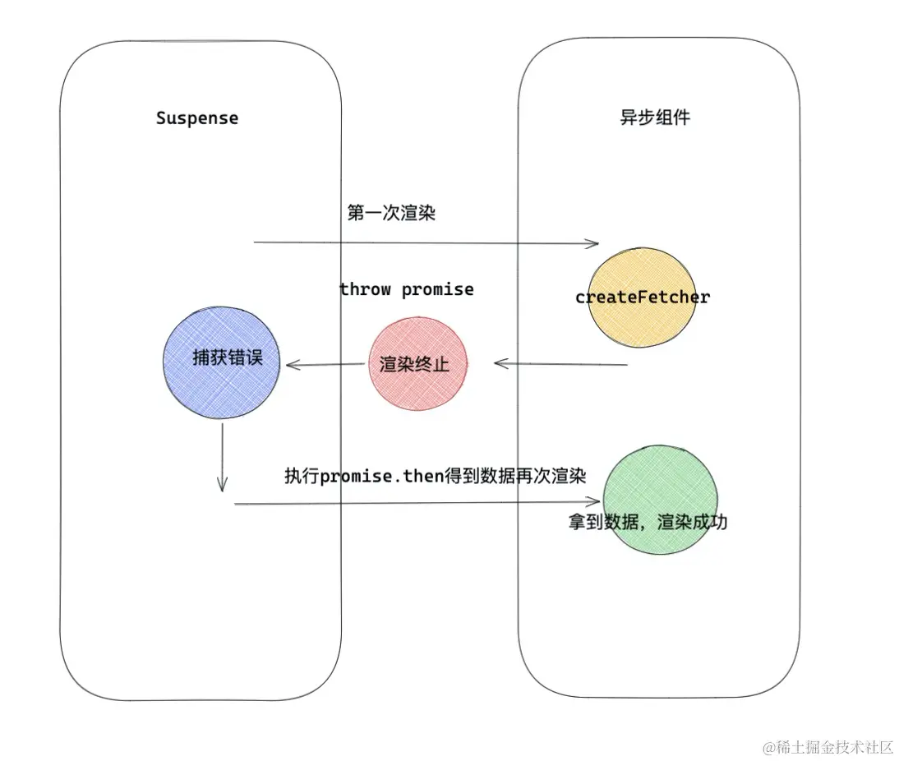

# 渲染调优

## 懒加载和异步渲染

### 异步渲染

`Suspense` 是 React 提出的一种同步的代码来实现异步操作的方案。Suspense 让组件‘等待’异步操作，异步请求结束后在进行组件的渲染，也就是所谓的异步渲染

### 动态加载(懒加载)

`Suspense` 配合 `React.lazy` 可以实现动态加载功能

#### React.lazy和Suspense实现动态加载原理

整个 render 过程都是同步执行一气呵成的，但是在 Suspense 异步组件情况下允许**调用 Render => 发现异步请求 => 悬停，等待异步请求完毕 => 再次渲染展示数据。**

**Suspense原理：**

Suspense 在执行内部可以通过 `try{}catch{}` 方式捕获异常，这个异常通常是一个 Promise ，可以在这个 Promise 中进行数据请求工作，Suspense 内部会处理这个 Promise ，Promise 结束后，Suspense 会再一次重新 render 把数据渲染出来，达到异步渲染的效果。


**React.lazy原理**

`lazy` 内部模拟一个 promiseA 规范场景。完全可以理解为 `React.lazy` 用 Promise 模拟了一个请求数据的过程，但是请求的结果不是数据，而是一个动态的组件。下一次渲染就直接渲染这个组件，所以是 React.lazy 利用 Suspense 接收 Promise ，执行 Promise ，然后再渲染这个特性做到动态加载的。

> react/src/ReactLazy.js

```js
function lazy(ctor){
    return {
         $$typeof: REACT_LAZY_TYPE,
         _payload:{
            _status: -1,  //初始化状态
            _result: ctor,
         },
         _init:function(payload){
             if(payload._status===-1){ /* 第一次执行会走这里  */
                const ctor = payload._result;
                const thenable = ctor();
                payload._status = Pending;
                payload._result = thenable;
                thenable.then((moduleObject)=>{
                    const defaultExport = moduleObject.default;
                    resolved._status = Resolved; // 1 成功状态
                    resolved._result = defaultExport;/* defaultExport 为我们动态加载的组件本身  */ 
                })
             }
            if(payload._status === Resolved){ // 成功状态
                return payload._result;
            }
            else {  //第一次会抛出Promise异常给Suspense
                throw payload._result; 
            }
         }
    }
}
```
流程：React.lazy 包裹的组件会标记 `REACT_LAZY_TYPE` 类型的 element，在调和阶段会变成 `LazyComponent` 类型的 fiber ，React 对 `LazyComponent` 会有单独的处理逻辑：
- 第一次渲染首先会执行 `init` 方法，里面会执行 lazy 的第一个函数，得到一个Promise，绑定 Promise.then 成功回调，回调里得到将要渲染组件 defaultExport ，这里要注意的是，如上面的函数当第二个 if 判断的时候，因为此时状态不是 Resolved ，所以会走 else ，抛出异常 Promise，抛出异常会让当前渲染终止。
- 这个异常 Promise 会被 Suspense 捕获到，Suspense 会处理 Promise ，Promise 执行成功回调得到 defaultExport（将想要渲染组件），然后 Susponse 发起第二次渲染，第二次 `init` 方法已经是 `Resolved` 成功状态，那么直接返回 result 也就是真正渲染的组件。这时候就可以正常渲染组件了。


## 渲染错误边界

React 组件渲染过程如果有一个环节出现问题，就会导致整个组件渲染失败，那么整个组件的 UI 层都会显示不出来，这样造成的危害是巨大的，如果越靠近 APP 应用的根组件，渲染过程中出现问题造成的影响就越大，有可能直接造成白屏的情况。

为了防止如上的渲染异常情况 React 增加了 `componentDidCatch` 和 `static getDerivedStateFromError()` 两个额外的生命周期，去挽救由于渲染阶段出现问题造成 UI 界面无法显示的情况。

## 从diff children看key的合理使用

异步渲染和渲染错误边界，都是对一些特殊情况下渲染的处理。大部分优化环节 React 都自己在内部处理了。但是有一种情况也值得开发者注意，那就是列表中 key 的使用。合理的使用 key 有助于能精准的找到用于新节点复用的老节点。 

那么，React 是如何 diff children 的呢？

### diff children 的流程

**第一步：遍历新 children ，复用 oldFiber**

> react-reconciler/src/ReactChildFiber.js

```js
function reconcileChildrenArray(){
    /* 第一步  */
    for (; oldFiber !== null && newIdx < newChildren.length; newIdx++) {  
        if (oldFiber.index > newIdx) {
            nextOldFiber = oldFiber;
            oldFiber = null;
        } else {
            nextOldFiber = oldFiber.sibling;
        }
        const newFiber = updateSlot(returnFiber,oldFiber,newChildren[newIdx],expirationTime,);
        if (newFiber === null) { break }
        // ..一些其他逻辑
        }  
        if (shouldTrackSideEffects) {  // shouldTrackSideEffects 为更新流程。
            if (oldFiber && newFiber.alternate === null) { /* 找到了与新节点对应的fiber，但是不能复用，那么直接删除老节点 */
                deleteChild(returnFiber, oldFiber);
            }
        }
    }
```
- 第一步对于 `React.createElement` 产生新的 child 组成的数组，首先会遍历数组，因为 fiber 对于同一级兄弟节点是用 sibling 指针指向，所以在遍历children 遍历，sibling 指针同时移动，找到与 child 对应的 oldFiber 。
- 然后通过调用 `updateSlot` ，`updateSlot` 内部会判断当前的 `tag` 和 `key` 是否匹配，如果匹配复用老 fiber 形成新的 fiber ，如果不匹配，返回 `null` ，此时 newFiber 等于 `null` 。
- 如果是处于更新流程，找到与新节点对应的老 fiber ，但是不能复用 `alternate === null` ，那么会删除老 fiber 。

**第二步：统一删除oldfiber**

```js
if (newIdx === newChildren.length) {
    deleteRemainingChildren(returnFiber, oldFiber);
    return resultingFirstChild;
}
```
- 第二步适用于以下情况，当第一步结束完 `newIdx === newChildren.length` 此时证明所有 newChild 已经全部被遍历完，那么剩下没有遍历 oldFiber 也就没有用了，那么调用 `deleteRemainingChildren` 统一删除剩余 oldFiber

    **情况一：节点删除**

    - **oldChild: A B C D**
    - **newChild: A B**    
    A , B 经过第一步遍历复制完成，那么 newChild 遍历完成，此时 C D 已经没有用了，那么统一删除 C D。

**第三步：统一创建newFiber**

```js
if(oldFiber === null){
   for (; newIdx < newChildren.length; newIdx++) {
       const newFiber = createChild(returnFiber,newChildren[newIdx],expirationTime,)
       // ...
   }
}
```
- 第三步适合如下的情况，当经历过第一步，oldFiber 为 null ， 证明 oldFiber 复用完毕，那么如果还有新的 children ，说明都是新的元素，只需要调用 `createChild` 创建新的 fiber

    **情况二：节点增加**

    - **oldChild: A B**
    - **newChild: A B C D** 
    A B 经过第一步遍历复制完，oldFiber 没有可以复用的了，那么直接创建 C D。

**第四步：针对发生移动和更复杂的情况**

```js
const existingChildren = mapRemainingChildren(returnFiber, oldFiber);
for (; newIdx < newChildren.length; newIdx++) {
    const newFiber = updateFromMap(existingChildren,returnFiber)
    /* 从mapRemainingChildren删掉已经复用oldFiber */
}
```
- `mapRemainingChildren` 返回一个 map ，map 里存放剩余的老的 fiber 和对应的 key (或 index )的映射关系。
- 接下来遍历剩下没有处理的 Children ，通过 `updateFromMap` ，判断 `mapRemainingChildren` 中有没有可以复用 oldFiber ，如果有，那么复用，如果没有，新创建一个 newFiber 。
- 复用的 oldFiber 会从 `mapRemainingChildren` 删掉。

    **情况三：节点位置改变**

    - **oldChild: A B C D**
    - **newChild: A B D C** 
    如上 A B 在第一步被有效复用，第二步和第三步不符合，直接进行第四步，C D 被完全复用，existingChildren 为空。

**第五步：删除剩余没有复用的oldFiber**

```js
if (shouldTrackSideEffects) {
    /* 移除没有复用到的oldFiber */
    existingChildren.forEach(child => deleteChild(returnFiber, child));
}
```
最后一步，对于没有复用的 oldFiber ，统一删除处理。

  **情况四：复杂情况(删除 + 新增 + 移动)**

  - **oldChild: A B C D**
  - **newChild: A E D B**
  首先 A 节点，在第一步被复用，接下来直接到第四步，遍历 newChild ，E被创建，D B 从 existingChildren 中被复用，existingChildren 还剩一个 C 在第五步会删除 C ，完成整个流程。

### 关于 diff Children 思考和 key 的使用

1. React diffChild 时间复杂度 `O(n^3)` 优化到 `O(n)`。
2. React key 最好选择唯一性的 id ，如上述流程，如果选择 Index 作为 key ，如果元素发生移动，那么从移动节点开始，接下来的 fiber 都不能做得到合理的复用。 index 拼接其他字段也会造成相同的效果。