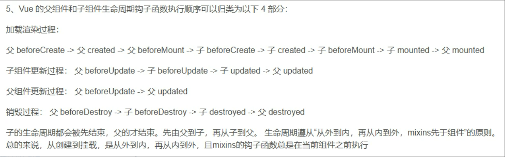
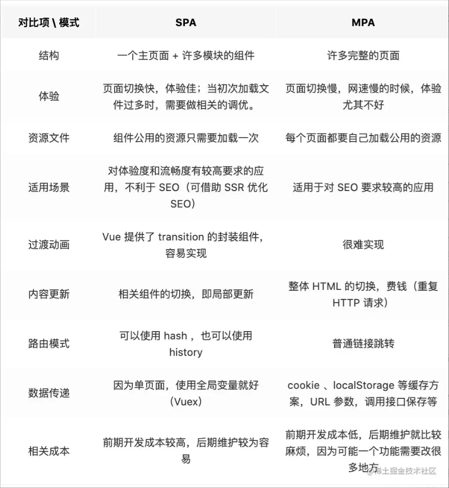

# vue面试题

## 框架的意义
不论是React还是Vue或者是Angular。这些框架本身，都是基于原生的基础上创造的。它们，底层依赖的还是javascript，并不是一门新的语言。在他们的底层逻辑下。我们使用框架所做出的一切行为，都会被框架转化为对原生DOM的操作。`框架，只是一个转化语法的工具。`
框架的初衷就是让用户使用尽量简单的技术，完成相对复杂的工作并提升一定的性能 （这其中包括但不限于:可维护性，可复用性，渲染效率等） 。
框架的本质是提升开发效率，让我们的注意力更加集中于数据。 


## vue的基本原理
当一个Vue实例创建时，Vue会遍历data中的属性，用 Object.defineProperty（vue3.0使用proxy ）将它们转为 getter/setter，并且在内部追踪相关依赖，在属性被访问和修改时通知变化。 每个组件实例都有相应的 watcher 程序实例，它会在组件渲染的过程中把属性记录为依赖，之后当依赖项的setter被调用时，会通知watcher重新计算，从而致使它关联的组件得以更新。

## vue模版编译原理

vue中的模板template无法被浏览器解析并渲染，因为这不属于浏览器的标准，不是正确的HTML语法，所有需要将template转化成一个JavaScript函数，这样浏览器就可以执行这一个函数并渲染出对应的HTML元素，就可以让视图跑起来了，这一个转化的过程，就称为模板编译。

模板编译又分三个阶段，解析parse，优化optimize，生成generate，最终生成可执行函数render。
+ **解析阶段：** 使用大量的正则表达式对template字符串进行解析，将标签、指令、属性等转化为抽象语法树AST。
+ **优化阶段：** 遍历AST，找到其中的一些静态节点并进行标记，方便在页面重渲染的时候进行diff比较时，直接跳过这一些静态节点，优化runtime的性能。
+ **生成阶段：** 将最终的AST转化为render函数字符串。


## 双向数据绑定的原理
Vue.js 是采用数据劫持结合发布者-订阅者模式的方式，通过Object.defineProperty()来劫持各个属性的setter，getter，在数据变动时发布消息给订阅者，触发相应的监听回调。主要分为以下几个步骤：
1. 需要observe的数据对象进行递归遍历，包括子属性对象的属性都加上setter和getter，这样的话，当给这个对象的某个值赋值，就会触发setter，那么就能监听到了数据变化
2. compile解析模板指令，将模板中的变量替换成数据，然后初始化渲染页面视图，并将每个指令对应的节点绑定更新函数，添加监听数据的订阅者，一旦数据有变动，收到通知，更新视图
3. Watcher订阅者是Observer和Compile之间通信的桥梁，主要做的事情是: ①在自身实例化时往属性订阅器(dep)里面添加自己 ②自身必须有一个update()方法 ③待属性变动dep.notice()通知时，能调用自身的update()方法，并触发Compile中绑定的回调，则功成身退。
4. MVVM作为数据绑定的入口，整合Observer、Compile和Watcher三者，通过Observer来监听自己的model数据变化，通过Compile来解析编译模板指令，最终利用Watcher搭起Observer和Compile之间的通信桥梁，达到数据变化 -> 视图更新；视图交互变化(input) -> 数据model变更的双向绑定效果。


## vue生命周期

### 1.创建流程

创建流程由两个阶段组成（beforeCreate和created）这里的创建之前和创建之后指的是数据监测和数据代理的创建之前和创建之后，而不是vm，因为这个时候vm并没有创建出来

#### 1.1 beforeCreate

在创建完这个vue实例之后，首先会进入一个初始化阶段，此阶段初始化生命周期和事件，但是在此阶段，数据代理还并没有开始。在初始化阶段之后，就是**beforeCreate**阶段。由于数据代理并未初始化，因此这个阶段是拿不到vm对象以及data数据的

#### 1.2 created

在**beforeCreate**之后，还是处于一个初始化阶段，即**init Ialinjections & reactivity**阶段。该阶段就是初始化这个数据监测和数据代理的。再初始化代理对象之后，就进入了**created**阶段。可以调用data中的数据和methods中的方法了

2. 挂载流程
####  2.1 beforeMount

在创建流程之后，还会有一个阶段来解析vue模板，在内存中生成虚拟DOM，但还没有把虚拟模板挂载到真正的页面当中去。故这个阶段的页面上的值是原生的html，并不是经过vue模板解析的值

#### 2.2 mounted

在**beforeMount**之后，还会有一个阶段将内存中编译好的模板，真正的替换到页面上去，也就是虚拟DOM转化为真实DOM存在页面中

在将真实DOM插入页面之后，vue就会开始调用**mounted**这个函数了。因为页面中已经呈现的是经过vue编译的DOM，因此在这个函数中对DOM的操作均有效

3. 更新流程
#### 3.1 beforeUpdate

只要data中的数据发生改变，就会触发这个钩子函数，但是在这个阶段上，页面上渲染的数据和被改变的数据没有保持同步，就是页面还没来得及展示被修改的值

#### 3.2 updated

在**beforeUpdate**阶段结束之后，会经过一个**Virtual DOM re-render and patch**阶段，在这个阶段就会生成新的虚拟DOM，随后通过diff算法，实现新旧的虚拟DOM的比较，最终完成页面的更新

4. 销毁流程
#### 4.1 beforeDestroy

在这个函数中，销毁的实例中的所有的data，method还有指令等等都是处于可用状态，但是不能对实例中具体的数据和方法进行一个操作

#### 4.2 destroyed

在到了这个最终的销毁方法之后，vue实例算是彻底的被销毁了，但是页面上的数据是还在的，但是不能操作上面的数据了

### 总结

#### 常用的生命周期钩子

mounted：发送ajax，启动定时器，绑定自定义事件，消息订阅等初始化操作

beforeDestroy：清除定时器，解绑自定义事件，取消消息订阅

#### 父组件和子组件生命周期钩子执行顺序



## 一般在哪个生命周期请求异步数据

我们可以在钩子函数 `created、beforeMount、mounted` 中进行调用，因为在这三个钩子函数中，`data` 已经创建，可以将服务端端返回的数据进行赋值。​

推荐在 created 钩子函数中调用异步请求，因为在 created 钩子函数中调用异步请求有以下优点：
+ 能更快获取到服务端数据，减少页面加载时间，用户体验更好；
+ SSR不支持 beforeMount 、mounted 钩子函数，放在 created 中有助于一致性。

## v-if和v-show的区别：

### v-if：

切换时涉及元素的重新添加和删除，适用于条件性渲染较大块的内容或组件，或者不经常变化的组件使用

### v-show：

通过设置CSS来进行元素的显示与隐藏，适用于需要频繁切换显示和隐藏的元素

## vue与react的异同

### 相似之处

+ 都将注意力集中保持在核心库，而将其他功能如路由和全局状态管理交给相关的库；
+ 都有自己的构建工具，能让你得到一个根据最佳实践设置的项目模板；
+ 都使用了Virtual DOM（虚拟DOM）提高重绘性能；
+ 都有props的概念，允许组件间的数据传递；
+ 都鼓励组件化应用，将应用分拆成一个个功能明确的模块，提高复用性。

### 不同之处

1. 数据流：
Vue默认支持双向数据绑定，而React一直提倡单向数据流
2. 虚拟DOM：Vue2.x开始引入"Virtual DOM"，消除了和React在这方面的差异，但是在具体的细节还是有各自的特点
 + Vue宣称可以更快地计算出Virtual DOM的差异，这是由于它在渲染过程中，会跟踪每一个组件的依赖关系，不需要重新渲染整个组件树。
 + 对于React而言，每当应用的状态被改变时，全部子组件都会重新渲染。当然，这可以通过 `PureComponent/shouldComponentUpdate` 这个生命周期方法来进行控制，但Vue将此视为默认的优化。
3. 组件化
React与Vue最大的不同是模板的编写。
 + Vue鼓励写近似常规HTML的模板。写起来很接近标准 HTML元素，只是多了一些属性。
 + React推荐你所有的模板通用JavaScript的语法扩展——JSX书写。
+ 具体来讲：React中 `render` 函数是支持闭包特性的，所有 `import` 的组件在 `render` 中可以直接调用。但是在Vue中，由于模板中使用的数据都必须挂在 `this` 上进行一次中转，所以 `import` 一个组件完了之后，还需要在 `components` 中再声明下。
4. 监听数据变化的实现原理不同：
 + Vue 通过 `getter/setter` 以及一些函数的劫持，能精确知道数据变化，不需要特别的优化就能达到很好的性能
 + React 默认是通过比较引用的方式进行的，如果不优化（PureComponent/shouldComponentUpdate）可能导致大量不必要的虚拟DOM的重新渲染。这是因为 Vue 使用的是可变数据，而React更强调数据的不可变。
5. 高阶组件
react可以通过高阶组件（HOC）来扩展，而Vue需要通过mixins来扩展。

高阶组件就是高阶函数，而React的组件本身就是纯粹的函数，所以高阶函数对React来说易如反掌。相反Vue.js使用HTML模板创建视图组件，这时模板无法有效的编译，因此Vue不能采用HOC来实现。
6. 构建工具
+ React ==> Create React APP
+ Vue   ==> vue-cli
7. 跨平台
+ React ==> React Native
+ Vue   ==> Weex

## 组件中的data为什么是一个函数

因为组件会被拿来复用，如果组件中的data是一个对象，多个组件中的data属性值会相互影响，但是如果组件中的data是一个函数，每个组件实例就可以独立维护一份被返回对象的拷贝，组件实例之间的data属性值就不会互相影响。而new Vue的实例是不会被复用的，所以不存在引用对象的问题

## computed和watch的区别：

#### computed：

+ 支持缓存，只有依赖的数据发生变化了才会重新计算
+ 不支持异步
+ computed的值会默认走缓存，计算属性是基于它们的响应式依赖进行缓存的，也就是基于data声明过，或者父组件传递过来的props中的数据进行计算的。
+ 如果一个属性是由其他属性计算而来的，这个属性依赖其他的属性，一般会使用computed
+ 如果computed属性的属性值是函数，那么默认使用get方法，函数的返回值就是属性的属性值；在computed中，属性有一个get方法和一个set方法，当数据发生变化时，会调用set方法。

#### watch：

+ 不支持缓存，数据变化时会触发相应的操作
+ 支持异步监听
+ 监听的函数接收两个参数，第一个参数是最新的值，第二个是变化之前的值
+ 当一个属性发生变化时，就需要执行相应的操作
+ 监听数据必须是data中声明的或者父组件传递过来的props中的数据，当发生变化时，会触发其他操作
  函数有两个的参数：
    + immediate：组件加载立即触发回调函数
    + deep：深度监听，发现数据内部的变化，在复杂数据类型中使用，例如数组中的对象发生变化。需要注意的是，deep无法监听到数组和对象内部的变化。
+ 当想要执行异步或者昂贵的操作以响应不断的变化时，就需要使用watch。

#### 总结
+ computed 计算属性 : 依赖其它属性值，并且 computed 的值有缓存，只有它依赖的属性值发生改变，下一次获取 computed 的值时才会重新计算 computed 的值。
+ watch 侦听器 : 更多的是观察的作用，无缓存性，类似于某些数据的监听回调，每当监听的数据变化时都会执行回调进行后续操作。
#### 运用场景
当需要进行数值计算,并且依赖于其它数据时，应该使用 computed，因为可以利用 computed 的缓存特性，避免每次获取值时都要重新计算。
当需要在数据变化时执行异步或开销较大的操作时，应该使用 watch，使用 watch 选项允许执行异步操作 ( 访问一个 API )，限制执行该操作的频率，并在得到最终结果前，设置中间状态。这些都是计算属性无法做到的。

## Computed和Methods的区别：
可以将同一函数定义为一个 method 或者一个计算属性。对于最终的结果，两种方式是相同的
不同点：
+ computed: 计算属性是基于它们的依赖进行缓存的，只有在它的相关依赖发生改变时才会重新求值；
+ method 调用总会执行该函数。

## vue2和vue3的区别

  1. 响应式系统：
  vue3使用Proxy实现响应式，提供更细粒度的响应式追踪
  消除了vue2中基于Object.defineProperty的实现所存在的很多限制
  可以检测对象，检测属性的添加和删除，检测数组的索引和长度的变更
  2. 性能提升：
  虚拟DOM优化，编译器优化，响应式系统优化
  作用域插槽：2.x的机制导致作用域插槽变了，父组件会重新渲染，而3.0把作用域插槽改成了函数的方式，这样只会影响子组件的重新渲染，提升渲染性能。
  3. 组合式API：
  组合式API是一种全新的vue.js的组件编写方式，可以更好的组合和复用组件逻辑
  4. 与TS的结合：
    + vue2.x 中的组件是通过声明的方式传入一系列 option，和 TypeScript 的结合需要通过一些装饰器的方式来做，虽然能实现功能，但是比较麻烦。
    + 3.0 修改了组件的声明方式，改成了类式的写法，这样使得和 TypeScript 的结合变得很容易
  5. 生命周期函数：
  beforeDestroy更名为beforeUnmount，destroyed更名为unmounted，同时引入了新的生命周期函数如onMounted、onUpdated等，与Composition API配合使用
  6. 引入新的组件：
  Teleport组件：可以方便的将组件插入到DOM的其他位置
  Suspense组件：可以更好的处理异步请求和组件加载过程中的状态
  7. 其他
   + 支持自定义渲染器，从而使得 weex 可以通过自定义渲染器的方式来扩展，而不是直接 fork 源码来改的方式。
   + 支持 Fragment（多个根节点）和 Protal（在 dom 其他部分渲染组建内容）组件，针对一些特殊的场景做了处理。
   + 基于 tree shaking 优化，提供了更多的内置功能。

## 使用Object.defineProperty()来进行数据劫持有什么缺点

在对一些属性进行操作时，使用这种方法无法拦截，比如通过下标方式修改数组数据或者给对象新增属性，这都不能触发组件的重新渲染，因为 `Object.defineProperty` 不能拦截到这些操作。更精确的来说，对于数组而言，大部分操作都是拦截不到的，只是 Vue 内部通过重写函数的方式解决了这个问题。
在 Vue3.0 中已经不使用这种方式了，而是通过使用 Proxy 对对象进行代理，从而实现数据劫持。使用Proxy 的好处是它可以完美的监听到任何方式的数据改变，唯一的缺点是兼容性的问题，因为 Proxy 是 ES6 的语法。


## Proxy和Object.defineProperty的区别

它们都可以实现js对象的响应式，但是有一些区别

1. 实现方式
proxy是es6新增的一种特性，响应式原理主要是基于拦截器（handler）和代理对象（proxy）之间的机制。当创建一个 `Proxy` 对象时，需要传入一个拦截器对象，该拦截器对象包含了一系列捕获器（handlers），其中最常用的是 `get` 和 `set` 捕获器。

而Object.defineProperty是在es5中引入的，使用getter和setter方法实现

2. 作用对象
proxy可以代理整个对象，包括对象的所有属性，数组的所有元素以及类似数组对象的所有元素；而Object.defineProperty只能代理对象上定义的属性。

3. 拦截方法
proxy有多达13种拦截方法，是Object.defineProperty不具备的

4. 监听属性
proxy可以监听到新增属性和删除属性的操作，而Object.defineProperty只能监听到已经定义的属性的变化。

5. 性能
proxy内部实现采用了更加高效的算法

6. 兼容性
Object.property兼容性比proxy兼容性好

## vue如何监听对象或者数组某个属性的变化

当在项目中直接设置数组的某一项的值，或者直接设置对象的某个属性值，这个时候，你会发现页面并没有更新。这是因为Object.defineProperty()限制，监听不到变化。

### 解决方式
+ `this.$set(你要改变的数组/对象，你要改变的位置/key，你要改成什么value)`
+ 调用这些数组的方法：`splice()、 push()、pop()、shift()、unshift()、sort()、reverse()`

vue源码里缓存了array的原型链，然后重写了这几个方法，触发这几个方法的时候会observer数据，意思是使用这些方法不用再进行额外的操作，视图自动进行更新。 推荐使用splice方法会比较好自定义,因为splice可以在数组的任何位置进行删除/添加操作

### `vm.$set`的实现原理
+ 如果目标是数组，直接使用数组的 splice 方法触发响应式；
+ 如果目标是对象，会先判读属性是否存在、对象是否是响应式，最终如果要对属性进行响应式处理，则是通过调用 `defineReactive` 方法进行响应式处理
> `defineReactive` 方法就是 Vue 在初始化对象时，给对象属性采用 `Object.defineProperty` 动态添加 `getter 和 setter` 的功能所调用的方法


## vue2响应式原理

通过Object.defineProperty方法将data选项中的属性转化为响应式属性，并在访问属性时依赖收集，在属性值变化时通知依赖的watcher对象进行更新操作，从而实现数据的响应式更新，响应式原理的设计思想就是数据劫持+观察者模式。

#### 过程

1. 首先初始化时，在业务逻辑层中的监听器（Observer）中vue会遍历data选项的每一个key，利用Object.defineProperty为key添加getter和setter对数据的读取进行劫持，数组则是通过重写数组方法来实现。同时Object.defineProperty会为每一个key创建一个Dep
2. 接下来对模板执行编译时，找到其中动态绑定的数据来初始化视图，找到一个就创建一个Watcher来维护这个数据，由于触发了这个数据的getter方法，便将对应Watcher添加到这个key对应的Dep中，这个过程发生在解析器（Compiler）中
3. data中数据一旦发生变化，会触发setter，便可通过对应Dep调用notify方法通知其管理所有Watcher更新
## vue3响应式原理

vue3使用了es6原生的Proxy来进行数据劫持。

1. proxy对象的使用：Vue使用proxy对象来拦截对象属性的读取和修改操作。当一个组件被创建时，Vue会为组件的data对象创建一个Proxy代理对象。这个代理对象会代理data对象，拦截其属性的读取和修改，并在必要时触发响应式更新。
2. 依赖收集和触发更新：在Vue3中，使用watchEffect或watch函数来声明依赖的副作用逻辑，vue会自动进行依赖收集。当响应式对象被读取时，会建立依赖关系，当属性发生变化时，vue会触发相应的重新渲染。
3. 响应式对象的创建：在vue3中，可以使用reactive函数来创建一个响应式对象，接受一个普通对象作为参数并返回一个代理对象


## diff

#### vue2中的diff算法：

1. 节点比较。vue2的diff算法会对新旧两个节点进行深度优先遍历
a.  比较两个节点是不是同类标签，不是则直接替换

b.  比较两个节点是否相等，是则结束比较

c.  两个节点不相等，在继续比较。

2. 列表渲染优化。在进行同一层级的两组新旧节点的比较中，会遍历较短的那一组节点。这种方法在处理列表渲染，尤其是当列表元素发生变化时，可能不够高效
#### vue3中的diff算法：

1. 静态标记：vue3引入了静态标记的优化。在编译阶段，编译器会对静态节点进行标记，这些节点在更新时会被直接跳过，从而减少了不必要的比较
2. 动态删除操作：对于动态删除操作，vue3采用了异步队列的方式进行处理，能够将多个删除操作合并为一个从而减少DOM的操作次数。
3. 缓存和重用节点：vue3在每次更新时会将新旧节点缓存起来，只对数组中不用的节点进行比较，从而减少对比次数。
#### vue2和vue3的diff算法比较

1. 效率提升：vue3通过引入静态标记，动态节点处理等优化手段显著提升了diff算法的效率。
2. 列表渲染优化：与vue2相比，vue3在处理列表渲染时更加高效，当列表元素发生变化时，vue3能更好的追踪元素的移动从而减少不必要的操作
3. 代码体积和性能：vue3在保持vue2原有功能的基础上，使用一系列优化手段减小了代码体积并提高了运行的性能。


## vue中key的作用

key是一个特殊的属性，主要作用是为每一个节点提供一个唯一的标识符

1. 提高渲染效率：当vue再进行虚拟DOM的diff算法比较节点的时候，如果节点具有相同的key，则vue会认为它们是相同的节点，从而避免不必要的渲染。
2. 强制重新渲染组件：在某些特定的场景下，我们可能需要强制重新渲染某个组件或元素，这个时候可以通过动态改变key的值来达到重新渲染的效果。

## key取唯一值的原因

1. **高效更新虚拟DOM**
   + 唯一标识：key是Vue中虚拟DOM节点的唯一标记。通过这个key，Vue的diff算法可以更准确、更快速地识别出新旧虚拟DOM之间的差异，从而只更新真正需要改变的节点，而不是重新渲染整个列表或组件。
   + 减少不必要的渲染：当数据发生变化时，Vue会根据key值来判断哪些节点需要被更新、删除或重新渲染。如果key值唯一，Vue就能精确地定位到需要变化的节点，避免不必要的DOM操作，从而提高渲染效率。
2. **区分相同类型的节点**
   + 避免复用错误：在Vue中，当使用v-for指令渲染列表时，它默认使用“就地复用”的策略。如果列表中的数据项发生了变化（如添加、删除或移动），Vue会尝试复用已有的DOM节点，而不是重新创建它们。如果列表项没有唯一的key，Vue可能会复用错误的节点，导致渲染结果不符合预期。
   + 保持元素状态：对于需要保持状态的元素（如输入框），如果它们被错误地复用，可能会导致状态丢失或混乱。使用唯一的key可以确保每个元素在更新时都能保持其独特的身份和状态。
3. **提高组件性能**
   + 优化渲染过程：Vue的渲染过程是一个复杂的计算过程，涉及虚拟DOM的创建、比较和更新。如果key值唯一且稳定，Vue就能更高效地执行这些操作，减少计算量，提高渲染速度。
   + 避免性能问题：如果列表项使用不稳定的key（如索引index），当列表顺序发生变化时，所有的key都会更新，导致Vue需要重新渲染整个列表。这不仅会增加计算量，还可能引起性能问题。


## 对虚拟DOM的理解

虚拟DOM是一种编程概念，用于在内存中描述真实的DOM树结构。它是React和Vue等用于提高性能的关键技术之一。

虚拟DOM的主要思想是在内存中构建一个轻量级的DOM树，然后通过比较这个虚拟DOM树与实际DOM树的差异，最小化DOM操作来提高性能。

虚拟DOM的优势在于我们更新节点时候。它会检查哪些节点需要更新。尽量复用已有DOM，减少DOM的删除和重新创建。并且这些操作我们是可以通过自己手动操作javascript底层api实现的。只是我们手动操作会非常耗费我们的时间和精力。这个工作由虚拟DOM代劳，会让我们开发更快速便捷。

1. 性能优化：
   虚拟DOM可以减少dom操作次数（合并）。比如，原生js添加dom，要添加1000次，每次都是一个个的添加，但是虚拟dom可以将这1000次操作直接封装在一个数组里面一次性更新dom。
   可以省去多余的操作。（减少范围）通过比较新旧DOM树，框架可以只更新需要变化的部分，而不是整个实际DOM树，从而减少了页面重绘和重排的次数。
2. 跨平台兼容性
3. 简化开发
4. 提高可维护性

#### 缺点

1. 内存消耗： 虚拟DOM需要在内存中维护一份虚拟DOM树的副本，这可能会导致一定的内存消耗。特别是对于大型单页面应用或者拥有复杂UI结构的应用，虚拟DOM可能会占用较多的内存资源。
2. 初始化成本： 虚拟DOM在进行首次渲染时会有较大的初始化成本，因为需要将虚拟DOM转换为实际DOM。尤其是对于一些简单的页面或组件来说，虚拟DOM可能会增加不必要的性能开销。

### 虚拟DOM是如何合并patch的

1. 生成虚拟DOM树： 当前状态下的UI被表示为虚拟DOM树，这是一个轻量级的JavaScript对象树，它映射了实际的DOM结构。

2. 计算差异（Diffing）： 比较前后两个状态下的虚拟DOM树，找出两者之间的差异。这一过程通常采用Diff算法，比如Virtual DOM库中常用的算法是基于O(n^3)的时间复杂度的算法，但是由于优化，实际运行效率很高。

3. 生成patch（补丁）： 将差异转换为一系列操作，比如删除节点、添加节点、更新节点属性等，形成一个patch对象，描述了如何将前一个虚拟DOM树转换为后一个虚拟DOM树。

4. 合并patch： 将生成的patch应用到实际的DOM上，更新实际的DOM结构。这一过程通常通过遍历patch对象，并根据其中的操作类型执行相应的DOM操作来实现。

## Vue中封装的数组方法有哪些，其如何实现页面更新
在Vue中，对响应式处理利用的是Object.defineProperty对数据进行拦截，而这个方法并不能监听到数组内部变化，数组长度变化，数组的截取变化等，所以需要对这些操作进行hack，让Vue能监听到其中的变化。
Vue将被侦听的数组的变更方法进行了包裹，所以它们也将会触发视图更新。这些被包裹过的方法包括：
+ push()
+ pop()
+ shift()
+ unshift()
+ splice()
+ sort()
+ reverse()

Vue重写了数组中的那些原生方法，首先获取到这个数组的__ob__,也就是它的Observer对象，如果有新的值，就调用observeArray继续对新的值观察变化，然后手动调用notify，通知渲染watcher，执行update。


## nextTick的使用场景

### nextTick中的回调是在下次DOM更新结束之后执行的延迟回调。

### 使用场景

在Vue中，DOM的更新是异步的，即Vue异步执行更新队列，而不是直接操作DOM。因此，在数据变化后，如果想要执行一些操作确保在DOM更新后执行，就需要使用nextTick。具体场景包括但不限于：

1. 在数据变化后操作DOM元素。例如，获取更新后的DOM元素尺寸、位置等属性，或者对更新后的DOM元素进行某些操作
2. 触发子组件的方法。当父组件的数据变化影响到子组件时，可能需要在子组件的DOM更新后触发其某个方法
### 实现原理

### nextTick的实现原理是基于浏览器的异步任务队列和事件循环机制

当数据变化后，Vue会将DOM更新操作放到一个异步任务队列中等待下一次事件循环时执行。而nextTick方法则是将一个回调函数推入到这个异步任务队列中，等待DOM更新完成后执行。这样就可以确保在回调函数中获取到最新的DOM内容

Vue采用了数据驱动视图的思想，但是在一些情况下，仍然需要操作DOM。有时候，可能遇到这样的情况，DOM1的数据发生了变化，而DOM2需要从DOM1中获取数据，那这时就会发现DOM2的视图并没有更新，这时就需要用到了nextTick了。由于Vue的DOM操作是异步的，所以，在上面的情况中，就要将DOM2获取数据的操作写在$nextTick中。
```js
this.$nextTick(() => { ... 获取数据的操作 })
```

使用nextTick的场景：
+ 在数据变化后执行的某个操作，而这个操作需要使用随数据变化而变化的DOM结构的时候，这个操作就需要方法在nextTick()这个回调函数中。
+ 在vue生命周期中，如果在created()钩子进行DOM操作，也一定要放在nextTick()的回调函数中。——因为在created()钩子函数中，页面的DOM还未渲染，这时候也没办法操作DOM，所以，此时如果想要操作DOM，必须将操作的代码放在nextTick()的回调函数中。

## keep-alive

`keep-alive` 是 Vue 中的一个内置组件，用于缓存动态组件或路由组件，以提升应用性能。
使用 `keep-alive` 可以避免频繁销毁和重建组件，从而减少不必要的性能开销。

`keep-alive` 可以通过设置路由的 `meta` 字段，然后经过计算来实现组件的缓存控制。
```js
const routes = [
  {
    path: '/componentA',
    component: ComponentA,
    // keepAlive：在路由配置中为需要缓存的路由设置的字段。true 表示需要缓存，false 或不设置表示不缓存。
    meta: { keepAlive: true }
  },
  // 其他路由
]
```

```vue
<template>
  <keep-alive :include="cachedComponents">
    <router-view></router-view>
  </keep-alive>
</template>

<script>
export default {
  computed: {
    // cachedComponents：通过计算属性获取需要缓存的组件名称列表，并传递给 keep-alive 的 include 属性。
    cachedComponents() {
      // $route.matched：返回当前匹配到的所有路由记录。
      return this.$route.matched
        .filter(route => route.meta.keepAlive)
        .map(route => route.name);
    }
  }
}
</script>
```

### 基本属性
+ **include：** 字符串或正则表达式，只有名称匹配的组件会被匹配
+ **exclude：** 字符串或正则表达式，任何名称匹配的组件都不会被缓存，exclude的优先级大于include
+ **max：** 数字，最多可以缓存多少组件实例

### 生命周期钩子

+ **activated:** 当组件从缓存中被激活时调用。
+ **deactivated:** 当组件被缓存时调用，而不是被销毁。

### 原理

`keep-alive` 组件本质上是一个高阶组件，通过内部管理一个缓存对象来存储组件实例。当组件被缓存时，它的 DOM 会被移除，但实例和数据状态会被保留。当再次激活该组件时，它的实例会从缓存中恢复，而不需要重新创建。
超过组件缓存的数量上限时，会涉及到一个 LRU 算法，用来计算最久没有使用过的组件，并进行销毁。


## v-model的原理

v-model本质上是个语法糖，在内部为不同的输入元素使用不同的property并抛出不同的事件

* text和textarea元素使用value作为property并将input作为事件
* chackbox元素使用checked作为property并将change作为事件
* select元素使用value作为property并将change作为事件
```plain
<input v-model="sth">
<input v-bind="sth" v-on:input="sth = $event.target.value">
```

## 初始化页面闪动问题

这个现象是因为Vue在解析代码之前需要一点时间，vue在这个短暂的空隙里会展示出原始的模板

### 解决方案

1. v-cloak可以在元素上加上这个指令，然后在css中定义样式，让这个元素在vue解析之前一直不可见，直到一切就绪后再显示出来
```plain
<div v-cloak>{{ message }}</div>

// css
[v-cloak] {
  display: none;
}
```
1. v-if
```plain
<div v-if="isVueReady">{{ message }}</div>

// js
data() {
  return {
    isVueReady: false
  };
},
mounted() {
  this.isVueReady = true;
}
```

## slot是什么，有什么作用，原理是什么

slot插槽，一般封装组件的时候使用，在组件内不知道以哪种形式来展现内容时可以用slot来占据位置，最终展示形式由父组件以内容形式传递过来，主要分为三种

* 默认插槽，又名匿名插槽，当slot没有指定name属性值的时候的一个默认显示插槽，一个组件内只能有一个默认插槽
* 具名插槽，带有具体名字的插槽，也就是带有name属性的slot，一个组件可以出现多个具名插槽
* 作用域插槽，默认插槽、具名插槽的一个变体，可以是默认插槽也可以是具名插槽，该插槽的不同点是在子组件渲染作用域时，可以将子组件内部的数据传递给父组件，让父组件根据子组件的传递过来的数据决定如何渲染该插槽
### 实现原理

当子组件vm实例化时，获取到父组件传入的slot标签的内容，存放在vm.$$slot中，默认插槽为vm.$$slot.default，具名插槽为vm.$$slot.xxx，xxx为插槽名。当组件执行渲染函数时，遇到slot标签，就使用$$slot中的内容进行替换，此时可以为插槽传递数据，若存在数据，则可称该插槽为作用域插槽


## Vuex刷新后数据丢失的原因？如何实现状态持久化？

vuex是js工程，数据是存储在内存中的，刷新会让vuex重新加载，导致数据全部初始化

1. 手动利用HTML5的本地存储
    * vuex的state在localStorage或sessionStorage或cookie或其他存储方式中取值
        * localStorage:localStorage的生命周期永久的，关闭页面或者浏览器之后localStorage中的数据也不会消失，除非localStorage主动删除数据，否则数据永远不会消失，以文件的方式存储在本地硬盘上。根据HTML标准规定，最大容量是5MB
        * sessionStorage:sessionStorage的生命周期只在当前浏览器窗口下，只要这个浏览器窗口没有关闭，即使刷新页面或者进入另外一个页面，数据依然存在，存储在客户端的浏览器中。
        * cookie:cookie的生命周期只在设置的cookie过期时间之前一直有效，即使窗口或浏览器关闭。存放数据大小为4K左右，有个数限制，一般不能超过20个，缺点是不能存储大数据并且不容易读取，存储在客户端的浏览器中
        * 由于vue是单页面应用，操作都是在一个页面跳转路由，所以sessionStorage较为合适
    * 在mutation定义的方法里面对vuex的状态操作的同时也做对于的存储操作
2. 利用vue-persistedstate插件
## Vuex、localstorage和sessionstorage的区别

1. vuex存储在内存，local存储在本地，session会话存储临时保存，只能存储字符串类型，对于复杂的对象可以使用JSON对象的stringify和parse来处理
2. vuex用于组件之间的传值，local和session主要用于不同页面之间的传值
3. 刷新页面vuex存储的值会丢失，关闭窗口session的值会清除，而local永远不会
4. 当一个组件改变数据希望另外一个组件也改变数据时，只要vuex可以做到

## 路由Vue-Router

vue-router是vue.js官方的路由管理器

前端路由vue-router的核心，在于——改变视图的同时不会向后端发出请求

### 路由模式

#### hash模式
hash 模式是一种把前端路由的路径用井号 # 拼接在真实 url 后面的模式。当井号 # 后面的路径发生变化时，浏览器并不会重新发起请求，而是会触发 onhashchange 事件。
+ hash模式所有的工作都是在前端完成的，不需要后端服务的配合
+ hash模式的实现方式就是通过监听URL中hash部分的变化，从而做出对应的渲染逻辑
+ hash模式下，URL中会带有#，看起来不太美观，但是兼容性好

#### history模式
history路由模式的实现，是要归功于HTML5提供的一个history全局对象，可以将它理解为其中包含了关于我们访问网页（历史会话）的一些信息。
同时它还暴露了一些有用的方法：
+ window.history.go 可以跳转到浏览器会话历史中的指定的某一个记录页
+ window.history.forward 指向浏览器会话历史中的下一页，跟浏览器的前进按钮相同
+ window.history.back 返回浏览器会话历史中的上一页，跟浏览器的回退按钮功能相同
+ window.history.pushState 可以将给定的数据压入到浏览器会话历史栈中
+ window.history.replaceState 将当前的会话页面的url替换成指定的数据

而history路由的实现，主要就是依靠于pushState与replaceState实现的，这里我们先总结下它们的一些特点：
+ 都会改变当前页面显示的url，但都不会刷新页面
+ pushState是压入浏览器的会话历史栈中，会使得history.length加1，而replaceState是替换当前的这条会话历史，因此不会增加history.length
  
事件处理程序popstate：调用 history.pushState() 或者 history.replaceState() 不会触发 popstate 事件。popstate 事件只会在浏览器某些行为下触发，比如点击后退按钮（或者在 JavaScript 中调用 history.back() 方法）。即，在同一文档的两个历史记录条目之间导航会触发该事件。
总结：
+ history.pushState和history.replaceState方法是不会触发popstate事件的
+ 但是浏览器的某些行为会导致popstate，比如go、back、forward
+ popstate事件对象中的state属性，可以理解是我们在通过history.pushState或history.replaceState方法时，传入的指定的数据

#### 重点：
hash模式是不需要后端服务配合的。但是history模式下，如果你再跳转路由后再次刷新会得到404的错误，这个错误说白了就是浏览器会把整个地址当成一个可访问的静态资源路径进行访问，然后服务端并没有这个文件

#### 总结：
+ 一般路由实现主要有history和hash两种方式
+ hash的实现全部在前端，不需要后端服务器配合，兼容性好，主要是通过监听hashchange事件，处理前端业务逻辑
+ history的实现，需要服务器做以下简单的配置，通过监听pushState及replaceState事件，处理前端业务逻辑


### 菜单权限用动态添加路由addRoutes解决

有一个公共路由，登录后获取权限，得到需要动态添加的路由表，把路由添加到router里。实现方式是提前定义好完整的路由表，然后跟后台传输的权限做对比，过滤出一个路由权限表，再用addRoutes动态添加到路由里。然后根据过滤出的路由权限表渲染侧边栏。

### 路由通常有两种主要模式：前端路由和后端路由。

1. 前端路由：
+ 前端路由是在浏览器端进行处理的路由方式，常见于单页面应用（SPA）。
+ 它基于浏览器的 History API 或者 hash（#）来管理页面的导航和 URL 的变化。
+ 前端路由可以在不刷新整个页面的情况下，通过 JavaScript 更新视图，提升了用户体验。
#### 原理
+ 在前端路由中，当用户点击页面链接或执行某些操作时，JavaScript会拦截这些事件，并根据定义的路由规则，通过History API或hash来改变URL。
+ 这些URL的变化不会触发整个页面的重新加载，而是由前端框架（如React Router、Vue Router等）捕获到URL的变化，然后动态地更新视图，从而实现页面的切换和内容的更新。
+ 前端路由的原理基于浏览器提供的API和JavaScript框架的路由机制，它不需要向服务器发送额外的请求，因此速度较快，但可能会增加一些复杂性和对浏览器的支持要求。

2. 后端路由：
+ 后端路由是在服务器端进行处理的路由方式，常见于传统的多页面应用。
+ 它基于 URL 的路径来确定哪个页面或服务应该处理客户端的请求。
+ 每次客户端发送请求时，服务器都会解析 URL 并匹配相应的路由，然后返回相应的内容。
#### 原理
* 在后端路由中，服务器接收到客户端发来的请求后，会根据请求的URL路径来确定应该由哪个处理程序（或控制器）来处理该请求。
* 服务器端框架（如Express.js、Django等）通常会设置路由规则，将不同的URL映射到不同的处理函数或控制器上。
* 当客户端发送请求时，服务器会解析URL，并根据路由规则来匹配相应的处理程序，然后执行对应的逻辑并返回结果给客户端。
* 后端路由的原理基于服务器端框架提供的路由功能，它需要向服务器发送请求来获取新页面的内容，因此每次页面切换都会导致页面的完整加载，速度相对较慢，但可以更好地支持搜索引擎优化（SEO）。

## Vue3-watchEffect(智能监测)

```js
let sum = ref(0)
let person = reactive（{
...
}）
watchEffect(
()=>{
const x1 = sum.value
const x2 = person.job.ji.salary
consoloe.log('监视到x1.x2中有人变了')
}
)
```

注意：watchEffect不用指明监视的是哪个data，callback中用到哪个就会自动监视哪个
watchEffect有点类似于computed，但是区别在于：
+ computed更注重监视的最后结果
+ watchEffect更注重监视的过程，所以不用写返回值

## watch 和 watchEffect 主要区别在于它们的使用方式和行为：

### 使用方式：

`watch` 是一个选项对象中的属性，用于在`Vue`组件中监听数据的变化，并执行相应的操作。
`watchEffect` 是一个函数，用于创建一个响应式的副作用函数，会在响应式依赖项发生变化时自动执行。
### 行为：

`watch` 会在监听的数据发生变化时执行相应的操作，可以访问新旧值，并且可以设置一些选项来控制监听行为。
`watchEffect` 创建的副作用函数会在依赖项变化时自动执行，不需要显式地定义监听哪些数据，适合用于执行一些副作用操作，比如更新`DOM`、发送请求等。且无法获取到变化前的值，只能获取到变化后的值
### 代码结构：

`watch` 的使用需要在组件的选项中定义，可以监听单个属性或对象内的属性。
`watchEffect` 可以直接在组件的 setup 函数中使用，不需要在选项中设置，更加简洁。

## vue3中ref和reactive的区别
### 原始类型的差异：
ref 对于基本类型和引用类型都可以，但是 reactive 只适用于引用类型
### 数据访问方式的不同：
对于 ref 来说，无论是原始类型还是对象，访问数据都需要通过 .value 的形式进行，更新数据的话也是通过 .value 的形式；
对于 reactive ，由于是 proxy 代理的对象数据，你可以直接获取到数据，不必添加 .value，更新和访问数据都可直接访问
### 监听方式的区别：
  + ref：可以直接监听到ref传递的原始类型数据，当传递的是对象的话，需要深度监听：deep: true
  + reactive：reactive 因为本质是对象，所以在 watch 的时候本能的会想添加 deep 属性，但是 vue 对其做了优化，使用 watch 监听 reactive 的时候可以不添加 deep 属性，也能够对其做深度监听


## vue2-全局事件总线($bus)

#### 前置知识点:
+ vue中给程序员用的api一般都加$
+ 全局事件总线的意义:可以跨越多级传递事件
+ vc-vuecomponent--指的是vue实例  vm指的是根app实例
+ vc上有$on这个api      绑定事件:   $on('事件名',(  )=>{   })        解绑事件：$off('事件名')    
+ > 重要：在beforecreated钩子中绑定$on  在befroedestoryed钩子中销毁$off
+ 通过原型链Vue.prototype.$bus=this(app实例)来安装实现全局总线
#### 全局事件总线安装：
```js
newVue({
  router,
  render:h=>h(App),
  beforcreated(){
    Vue. prototype.$bus = this  //安装事件总线
  }
}).$mount('#app')
```
#### 使用事件总线
情景：组件A发送事件，组件B监听事件
```js
// A：
	this.$bus.$emit('XX',数据)
// B:
  beforcreated(){
   this.$bus.$on('XX',callback)
  }
	beforedestoryed(){
   this.$bus.$off('XX') 
  }
```

## vue单页面应用与多页面应用的区别
+ SPA单页面应用（SinglePage Web Application），指只有一个主页面的应用，一开始只需要加载一次js、css等相关资源。所有内容都包含在主页面，对每一个功能模块组件化。单页应用跳转，就是切换相关组件，仅仅刷新局部资源。
+ MPA多页面应用 （MultiPage Application），指有多个独立页面的应用，每个页面必须重复加载js、css等相关资源。多页应用跳转，需要整页资源刷新。

区别：


## Vue template 到 render的过程
vue的模版编译过程主要如下：template -> ast -> render函数
vue 在模版编译版本的码中会执行 compileToFunctions 将template转化为render函数
```js
// 将模板编译为render函数
const { render, staticRenderFns } = compileToFunctions(template,options,...省略, this)
```
CompileToFunctions中的主要逻辑如下∶ 
（1）调用parse方法将template转化为ast（抽象语法树）
```js
constast = parse(template.trim(), options)
```
+ parse的目标：把tamplate转换为AST树，它是一种用 JavaScript对象的形式来描述整个模板。
+ 解析过程：利用正则表达式顺序解析模板，当解析到开始标签、闭合标签、文本的时候都会分别执行对应的 回调函数，来达到构造AST树的目的。
AST元素节点总共三种类型：type为1表示普通元素、2为表达式、3为纯文本

（2）对静态节点做优化
这个过程主要分析出哪些是静态节点，给其打一个标记，为后续更新渲染可以直接跳过静态节点做优化
深度遍历AST，查看每个子树的节点元素是否为静态节点或者静态节点根。如果为静态节点，他们生成的DOM永远不会改变，这对运行时模板更新起到了极大的优化作用。

（3）生成代码
generate将ast抽象语法树编译成 render字符串并将静态部分放到 staticRenderFns 中，最后通过 new Function(`` render``) 生成render函数。

## 子组件可以直接改变父组件的数据吗？
子组件不可以直接改变父组件的数据。这样做主要是为了维护父子组件的单向数据流。每次父级组件发生更新时，子组件中所有的 prop 都将会刷新为最新的值。如果这样做了，Vue 会在浏览器的控制台中发出警告。
Vue提倡单向数据流，即父级 props 的更新会流向子组件，但是反过来则不行。这是为了防止意外的改变父组件状态，使得应用的数据流变得难以理解，导致数据流混乱。如果破坏了单向数据流，当应用复杂时，debug 的成本会非常高。

## Vue是如何收集依赖的？


## Vue的优点
+ 轻量级框架：只关注视图层，是一个构建数据的视图集合，大小只有几十 kb ；
+ 简单易学：国人开发，中文文档，不存在语言障碍 ，易于理解和学习；
+ 双向数据绑定：保留了 angular 的特点，在数据操作方面更为简单；
+ 组件化：保留了 react 的优点，实现了 html 的封装和重用，在构建单页面应用方面有着独特的优势；
+ 视图，数据，结构分离：使数据的更改更为简单，不需要进行逻辑代码的修改，只需要操作数据就能完成相关操作；
+ 虚拟DOM
+ 运行速度更快：相比较于 react 而言，同样是操作虚拟 dom，就性能而言， vue 存在很大的优势。

## Vue模版编译原理
vue中的模板template无法被浏览器解析并渲染，因为这不属于浏览器的标准，不是正确的HTML语法，所有需要将template转化成一个JavaScript函数，这样浏览器就可以执行这一个函数并渲染出对应的HTML元素，就可以让视图跑起来了，这一个转化的过程，就称为模板编译。模板编译又分三个阶段，解析parse，优化optimize，生成generate，最终生成可执行函数render。

+ 解析阶段：使用大量的正则表达式对template字符串进行解析，将标签、指令、属性等转化为抽象语法树AST。
+ 优化阶段：遍历AST，找到其中的一些静态节点并进行标记，方便在页面重渲染的时候进行diff比较时，直接跳过这一些静态节点，优化runtime的性能。
+ 生成阶段：将最终的AST转化为render函数字符串。

## 对SSR（服务端渲染）的理解
SSR就是将Vue在客户端把标签渲染成HTML的工作放在服务端完成，然后再把HTML直接返回客户端
优点：
+ 更好的SEO
+ 首屏加载更快

缺点：
+ 开发条件会受到限制，服务器端渲染只支持beforeCreate和created两个钩子；
+ 当需要一些外部扩展库时需要特殊处理，服务端渲染应用程序也需要处于Node.js的运行环境；
+ 更多的服务端负载

## Vue的性能优化有哪些
（1） 编码阶段
+ 尽量减少data中的数据，data中的数据都会增加getter和setter，会收集对应的watcher
+ v-if和v-for不能连用
+ 如果需要使用v-for给每项元素绑定事件时使用事件代理
+ SPA 页面采用keep-alive缓存组件
+ 在更多的情况下，使用v-if替代v-show
+ key保证唯一
+ 使用路由懒加载、异步组件
+ 防抖、节流
+ 第三方模块按需导入
+ 长列表滚动到可视区域动态加载
+ 图片懒加载

## 对SPA单页面的理解，它的优缺点分别是什么？
SPA仅在Web页面初始化时加载相应的HTML、JavaScript 和 CSS。一旦页面加载完成，SPA 不会因为用户的操作而进行页面的重新加载或跳转；取而代之的是利用路由机制实现 HTML 内容的变换，UI 与用户的交互，避免页面的重新加载。

优点：
+ 用户体验好、快，内容的改变不需要重新加载整个页面，避免了不必要的跳转和重复渲染；
+ 基于上面的一点，SPA相对于服务器压力小
+ 前后端职责分离，架构清晰，前端进行交互逻辑，后端负责数据处理；

缺点：
+ 初次加载耗时多：为实现单页 Web 应用功能及显示效果，需要在加载页面的时候将 JavaScript、CSS 统一加载，部分页面按需加载；
+ 前进后退路由管理：由于单页应用在一个页面中显示所有的内容，所以不能使用浏览器的前进后退功能，所有的页面切换需要自己建立堆栈管理；
+ SEO难度较大：由于所有的内容都在一个页面中动态替换显示，所以在 SEO 上其有着天然的弱势。

## template 和 jsx有什么区别
template和jsx的都是render的一种表现形式，不同的是：JSX相对于template而言，具有更高的灵活性，在复杂的组件中，更具有优势，而 template 虽然显得有些呆滞。但是 template 在代码结构上更符合视图与逻辑分离的习惯，更简单、更直观、更好维护。

## MVVM的优缺点

## vue中的设计模式
1. MVC模式
2. MVVM模式
3. 观察者模式
4. 单例模式
5. 工厂模式
6. 适配器模式
7. 策略模式