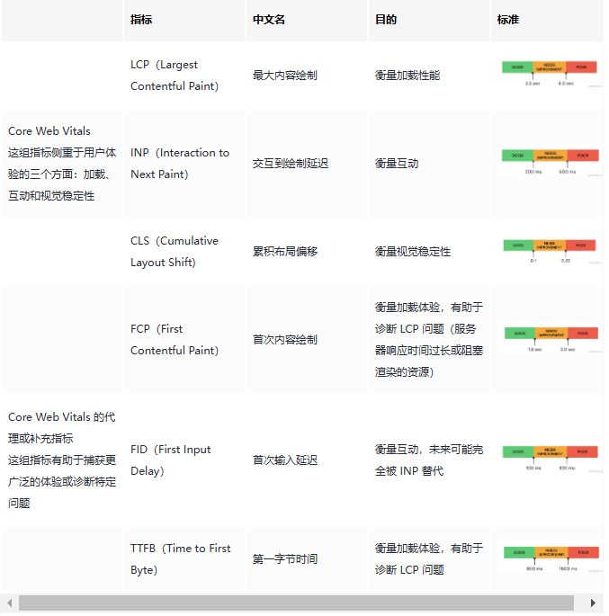

# 性能分析

## 性能测量

1. Chrome Lighthouse 插件
2. PageSpeed Insights

## Web Vitals Analytics

在页面实现测量和上报性能相关的数据。测量哪些性能相关的数据？性能相关的数据又该如何上报、搜集、分析、输出图标？

解决方案：Prometheus + Grafana。这套技术选型也是常见的用于数据采集、分析的解决方案。

###  6 个网页指标 Web Vitals

| 指标 | 标准 |
| :--: | :--: |
| LCP |  |
| INP |  |
| CLS |  |
| FCP |  |
| FID |  |
| TTFB |  |
