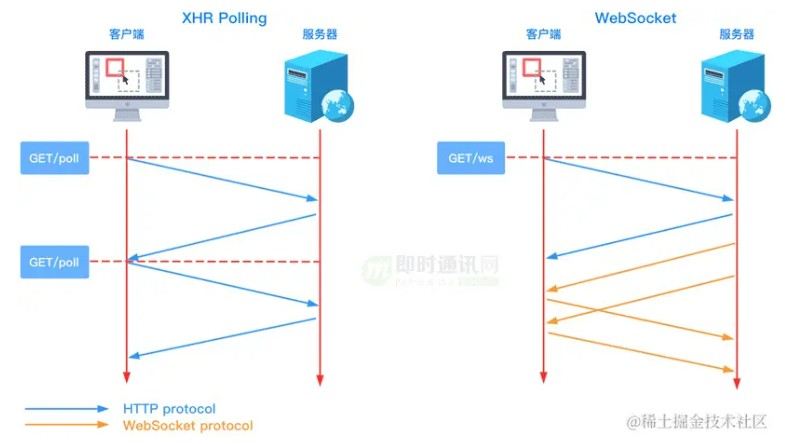
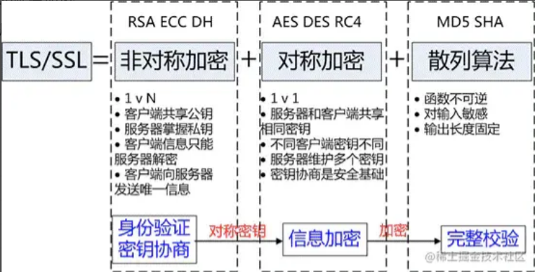
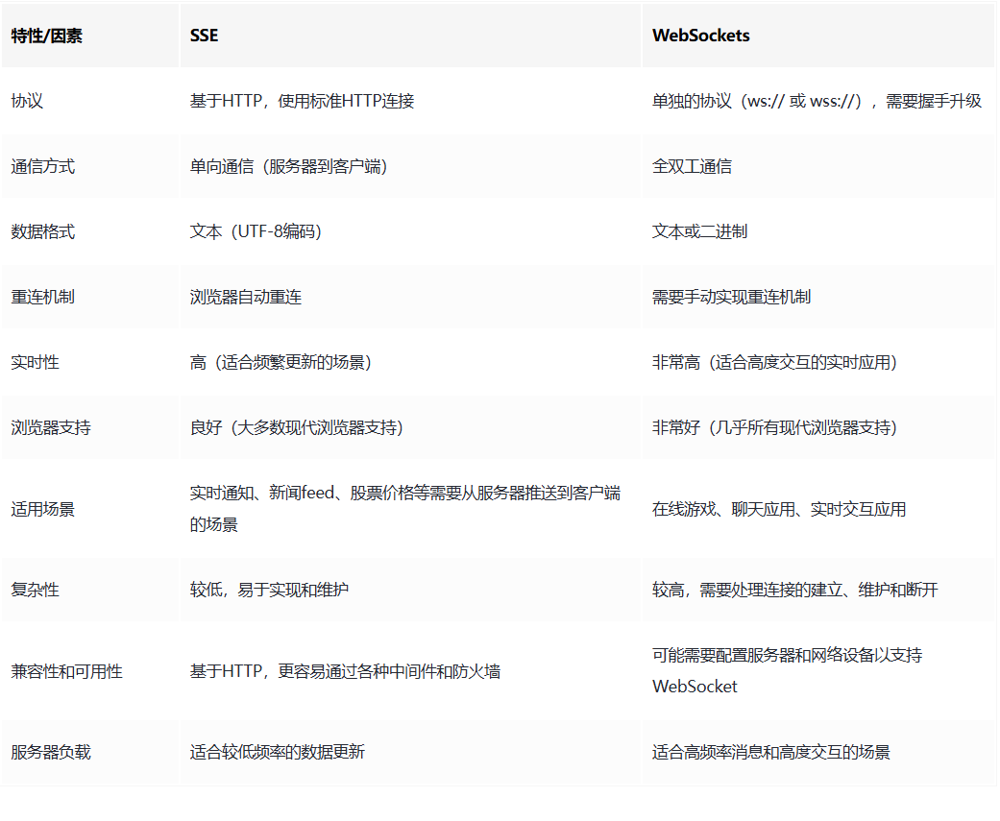

# CDN

## 概念

CDN 内容分发网络（Content Delivery Network），是一种通过位于全球各地的多个服务器来分发内容的网络服务。CDN 的目的是提高网站的访问速度、减少网络延迟，以及增加网站的稳定性和安全性。
原理：
目前互联网应用中都包含了大量的静态内容，如果不做任何处理，所有的请求都指向源站服务器的话，不仅会消耗大量的带宽，还会拖累页面的加载速度，影响用户的体验。
CDN的出现可以解决上述问题。CDN的本质仍然是一个缓存，通过在现有网络中增加一个新的缓存节点，可以将数据缓存在离用户最近的地方，使用户以最快的速度获取数据，不需要每个用户的请求都去源站上去获取，避免了网络拥挤，缓解源站压力。
当用户访问域名时，会先访问离他最近的CDN服务器，如果该服务器没有缓存，就会向域名原ip地址或者更上层的父级服务器进行查询，直到获取到数据，获取到数据后会在该CDN服务器上缓存，下次该地区的用户再次访问该CDN服务器时，就能直接获取到缓存，而不用去访问源ip地址。

## CDN的作用

CDN一般会用来托管Web资源（包括文本、图片和脚本等），可供下载的资源（媒体文件、软件、文档等），应用程序（门户网站等）。使用CDN来加速这些资源的访问。

1. 在性能方面，引入CDN的作用在于：
  + 用户收到的内容来自最近的数据中心，延迟更低，内容加载更快
  + 部分资源请求分配给了CDN，减少了服务器的负载
2. 在安全方面，CDN有助于防御DDoS、MITM等网络攻击：
  + 针对DDoS：通过监控分析异常流量，限制其请求频率
  + 针对MITM：从源服务器到 CDN 节点到 ISP（Internet Service Provider），全链路 HTTPS 通信
+ 除此之外，CDN作为一种基础的云服务，同样具有资源托管、按需扩展（能够应对流量高峰）等方面的优势。

## CDN原理

与DNS密切相关

用户使用CDN的过程：
1. 对于点击的数据的URL，经过本地DNS系统的解析，发现该URL对应的是一个CDN专用的DNS服务器，DNS系统就会将域名解析权交给CNAME指向的CDN专用的DNS服务器。
2. CND专用DNS服务器将CND的全局负载均衡设备IP地址返回给用户
3. 用户向CDN的全局负载均衡设备发起数据请求
4. CDN的全局负载均衡设备根据用户的IP地址，以及用户请求的内容URL，选择一台用户所属区域的区域负载均衡设备，告诉用户向这台设备发起请求
5. 区域负载均衡设备选择一台合适的缓存服务器来提供服务，将该缓存服务器的IP地址返回给全局负载均衡设备
6. 全局负载均衡设备把服务器的IP地址返回给用户
7. 用户向该缓存服务器发起请求，缓存服务器响应用户的请求，将用户所需内容发送至用户终端。

如果缓存服务器没有用户想要的内容，那么缓存服务器就会向它的上一级缓存服务器请求内容，以此类推，直到获取到需要的资源。最后如果还是没有，就会回到自己的服务器去获取资源。


## CDN使用场景

+ 使用第三方的CDN服务：如果想要开源一些项目，可以使用第三方的CDN服务
+ 使用CDN进行静态资源的缓存：将自己网站的静态资源放在CDN上，比如js、css、图片等。可以将整个项目放在CDN上，完成一键部署。
+ 直播传送：直播本质上是使用流媒体进行传送，CDN也是支持流媒体传送的，所以直播完全可以使用CDN来提高访问速度。CDN在处理流媒体的时候与处理普通静态文件有所不同，普通文件如果在边缘节点没有找到的话，就会去上一层接着寻找，但是流媒体本身数据量就非常大，如果使用回源的方式，必然会带来性能问题，所以流媒体一般采用的都是主动推送的方式来进行。


# WebSocket
+ WebSocket 是一种在单个 TCP 连接上进行全双工通信的网络传输协议。
+ WebSocket使得客户端和服务器之间的数据交换变得更加简单，允许服务端主动向客户端推送数据。客户端和服务器只需要完成一次握手，两者之间就可以创建持久性的连接，并进行双向数据传输。


### 功能和特性：
1. 实时通信：WebSocket 支持双向通信，浏览器和服务器可以实时地发送消息和接收消息，无需频繁地发起请求。
2. 低延迟：由于 WebSocket 是基于单个 TCP 连接的，不需要在每个请求之间建立和关闭连接，可以减少网络延迟和建立连接的开销，实现更快的实时通信。
3. 跨域支持：WebSocket 支持跨域通信，允许不同域的客户端与服务器建立连接，实现跨域数据传输。
4. 高效的数据传输：WebSocket 使用二进制协议，可以更高效地传输数据和处理大量的数据传输，适用于实时游戏、聊天应用等需要频繁数据交互的场景。
5. 自定义的消息格式：WebSocket 允许自定义消息格式和消息处理逻辑，可以根据业务需求设计消息结构和处理机制。

### 适用场景
+ 实时聊天应用： WebSocket 是实现实时聊天室、即时通讯应用的理想选择，因为它能够提供低延迟和高实时性。
+ 在线协作和协同编辑： 对于需要多用户协同工作的应用，如协同编辑文档或绘图，WebSocket 的实时性使得用户能够看到其他用户的操作。
+ 实时数据展示：对于需要实时展示数据变化的应用，例如股票行情、实时监控系统等，WebSocket 提供了一种高效的通信方式。
+ 在线游戏：在线游戏通常需要快速、实时的通信，WebSocket 能够提供低延迟和高并发的通信能力。
+ 推送服务：用于实现消息推送服务，向客户端主动推送更新或通知。

# 应用层的协议：
1. HTTP：用于在网络上传输超文本文档，是 Web 上最常见的应用层协议，用于客户端和服务器之间的通信。
2. HTTPS：是 HTTP 的安全版本，使用 SSL/TLS 协议对数据进行加密和身份验证，用于保护 Web 通信的安全性。
3. DNS：用于将域名解析为 IP 地址的协议，使用户能够通过易记的域名访问互联网资源。
4. WebSocket

# 传输层协议：
1. TCP：TCP是一种面向连接的、可靠的传输协议，它通过数据包的序列号、确认和重传机制来确保数据的可靠传输。TCP 还负责流量控制和拥塞控制，确保网络中的数据传输稳定顺畅。
2. UDP： UDP是一种无连接的传输协议，它提供了数据包的简单传输服务，但不保证数据的可靠性和顺序性。具有传输速度快，开销低的优点。UDP 适用于对实时性要求较高、对数据丢失较为容忍的应用场景，如音频、视频传输等。

# TCP和UDP的区别，为什么UDP不可靠
TCP和UDP都是传输层协议，它们都属于TCP/IP协议族
1. TCP
    + 面向连接
    + 可靠传输
    + 支持一对一，不支持广播和多播
    + 面向字节流
    + 提供全双工通信
    + 具有流量控制和拥塞控制机制
2. UDP
    + 面向无连接，不需要三次握手协议
    + 不可靠传输
    + 支持一对一，也支持广播和多播
    + 面向报文流
UDP为什么不可靠
+ 传输数据前不需要先建立连接 
+ 不提供数据重传机制
+ 不保证数据顺序性
+ 缺乏流量控制和拥塞控制

# 三次握手
三次握手是指建立一个TCP连接时，需要客户端和服务端一共发送三个包，主要作用是为了确认双方接收和发送能力是否正常
1. 第一次握手，客户端向服务器发送一个SYN（同步）报文，并指定初始序列号（ISN）。此时客户端进入SYN-SENT状态，等待服务器确认。（向服务器请求连接）
2. 第二次握手，服务器在接收到SYN报文后，会发送一个ACK（确认）报文作为响应，并同时发送一个SYN报文给客户端，服务器也会指定自己的初始序列号。此时服务器进入SYN-RECEIVED状态。（同意连接）
3. 第三次握手，客户端收到报文后，会发送一个ACK报文给服务器，表示握手成功。客户端和服务器都进入ESTABLISHED状态，此时TCP连接建立完成，双方可以开始传输数据。
# 为什么是三次而不是其他次数
三次握手是确定客户端和服务端接收和发送能力都正常（HTTP）的最优次数
  + 第一次： 客户端发送能力正常
  + 第二次： 服务端接收能力正常，服务端发送能力正常（接收和发送可以合并）
  + 第三次： 客户端接收能力正常 
+ 如果是两次握手，那么无法确保双方都同意建立连接，同时可能无法同步双方的初始序列号，导致数据传输出现问题。
+ 如果是四次或更多次握手，虽然理论上也可以达到建立可靠连接的目的，但是会增加通信的开销和延迟，没有必要。

# 四次挥手
指在TCP连接关闭时，通信双方各发送一次FIN（Finish）来结束数据传输，最终完成连接的关闭。
1. 第一次挥手，主动关闭方发送一个FIN报文，表示它已经完成了数据的发送任务，不再发送数据了。（请求断开连接）
2. 第二次挥手，被动关闭方收到FIN报文后，发送一个ACK报文作为确认，并进入CLOSE-WAIT状态。此时被动关闭方可以继续发送数据，但是不能接收数据了。
3. 第三次挥手，被动关闭方也准备好关闭连接时，会发送一个FIN报文给主动关闭方，表示它也已经完成了数据的发送任务。
4. 第四次挥手，主动关闭方收到FIN报文后，发送一个ACK报文作为确认，并进入TIME-WAIT状态。在等待一段时间后，如果没有收到被动关闭方的确认，主动关闭方会认为连接已经关闭，释放资源。被动关闭方在收到确认后，也会释放资源。
# 为什么是四次？
TCP 连接中需要四次挥手的原因主要是为了确保数据能够可靠地传输，同时防止出现未完成的数据传输或连接资源未正确释放的情况。
1. 全双工通信：TCP 是一种全双工通信协议，通信双方可以同时发送和接收数据。因此，在关闭连接时，双方都需要通知对方自己已经完成数据的发送任务，然后等待对方确认后再关闭连接。
2. 保证数据完整传输：第一次和第二次挥手是主动关闭方通知被动关闭方自己已经完成数据发送的过程，以确保对方接收到全部数据。而第三次和第四次挥手是被动关闭方通知主动关闭方自己也已经完成数据发送的过程，以确保数据传输的完整性。
3. 防止半关闭连接：TCP连接是全双工的，一方关闭连接不代表另一方也同时关闭，可能仍有数据在传输。四次挥手可以避免出现半关闭连接的情况，确保双方都成功关闭连接。
4. 确保可靠性：通过四次挥手，双方可以交换确认信息，确保对方已经接收到自己发送的结束通知，从而避免数据丢失或错误，保证连接的可靠关闭。

# get和post请求的区别
1. 传递的参数不同。post传递的参数在request body中，get传递的参数在url后拼接
2. get一般用于查询，post一般用于提交某种信息进行修改操作
3. post相对于get请求要安全些（参数包含在请求体中，长度没有限制）
4. get请求会被浏览器主动缓存，post不会，要手动设置。
5. get请求的长度有限制，post没有

# 常见的HTTP请求方法
+ GET：向服务器获取数据
+ POST：将实体提交到指定的资源，通常会造成服务器资源的修改
+ PUT：上传文件，更新数据
+ DELETE：删除服务器上的对象；
+ HEAD：获取报文首部，与GET相比，不返回报文主体部分；
+ OPTIONS：询问支持的请求方法，用来跨域请求；
+ CONNECT：要求在与代理服务器通信时建立隧道，使用隧道进行TCP通信；
+ TRACE：回显服务器收到的请求，主要⽤于测试或诊断。

# 常见的HTTP请求头和响应头
Request Header
+ Accept：浏览器能够处理的内容类型
+ Accept-Charset：浏览器能够显示的字符集
+ Accept-Encoding：浏览器能够处理的压缩编码
+ Accept-Language：浏览器当前设置的语言
+ Connection：浏览器与服务器之间连接的类型
+ Cookie：当前页面设置的任何Cookie
+ Host：发出请求的页面所在的域
+ Referer：发出请求的页面的URL
+ User-Agent：浏览器的用户代理字符串
Response Header
+ Date：表示消息发送的时间，时间的描述格式由rfc822定义
+ Server：服务器名称
+ Connection：服务器名称
+ Cache-Control：控制HTTP缓存
+ content-type：表示后面的文档属于什么MIME类型


# HTTP、TCP队头阻塞
+ HTTP队头阻塞
http队头阻塞是HTTP 基本的“请求 - 应答”模型所导致的。http规定报文必须是一发一收，并且请求和响应要在连接内按顺序队列处理，如果有请求的处理时间比较长，就会影响后续请求的处理
+ TCP队头阻塞
TCP协议为了保证数据传输的有序性，如果一个数据包在传输过程中丢失或失误，TCP接收端会要求重新发送该数据包直到成功接收为止，而这个数据包之后发送的数据包都要等待从而造成阻塞。


# HTTP状态码
+ 1xx 请求正在处理
+ 2xx 正常状态码
    · 200 请求处理成功
    · 201 请求成功并且服务器创建了新资源
    · 202 服务器已经接收请求，但尚未处理
+ 3xx 重定向状态
    · 301 请求重定向
    · 302 临时重定向
    · 303 临时重定向，使用get请求新的url
    · 304 浏览器协商缓存：资源未修改，使用缓存，返回304状态码
+ 4xx 错误状态码
    · 400 服务器无法理解的请求格式，需要修改请求内容后再次发起请求
    · 401 请求未授权
    · 403 禁止访问
    · 404 服务器上无法找到请求资源
+ 5xx 服务器错误
    · 500 服务端错误
    · 503 服务器暂时无法处理请求

# HTTP
1. HTTP/1.0：最早的版本，于1996年发布。它引入了请求头和响应头，使用单个连接传输一个请求和响应，不支持持久连接。
2. HTTP/1.1：于1999年发布，是目前最广泛使用的版本。它引入了持久连接、管道化（pipelining）、分块传输编码（chunked transfer encoding）等新特性，提高了性能和效率。
3. HTTP/2：于2015年发布，基于Google的SPDY协议。HTTP/2引入了头部压缩、多路复用等新特性，进一步提高了性能和效率。
4. HTTP/3：是基于UDP协议的QUIC协议上的HTTP版本，目的是解决TCP协议中的一些性能问题（TCP队头阻塞，TCP协议僵化）。HTTP/3仍在发展中，但已经开始被一些网站和服务采用。

# 不同HTTP版本之间的区别
1. HTTP 1.0和HTTP 1.1：
   + 连接方面：http1.0默认使用非持久连接，而1.1默认使用持久连接。http1.1使用持久连接来使多个http请求复用同一个TCP连接，以此来避免使用非持久连接时每次建立连接所需要时延
   + 资源请求方面：在http1.0中存在一些浪费带宽的现象，例如客户端只是需要某个对象的一部分，而服务器却将整个对象送过来了，并且不支持断点续传功能，http1.1则在请求头引入了range头域，它允许只请求资源的某个部分，即返回码是 206（Partial Content），这样就方便了开发者自由的选择以便于充分利用带宽和连接。
   + 缓存方面：在http1.0中主要使用header里的 If-Modified-Since、Expires 来做为缓存判断的标准，http1.1 则引入了更多的缓存控制策略，例如 Etag、If-Unmodified-Since、If-Match、If-None-Match 等更多可供选择的缓存头来控制缓存策略。
   + http1.1新增了host字段，用来指定服务器的域名。
   + http1.1相对于http1.0还新增了很多请求方法，如PUT，HEAD,OPTIONS等
2. HTTP 1.1和HTTP 2.0的区别：
   + 二进制协议：HTTP/2 是一个二进制协议。在 HTTP/1.1 版中，报文的头信息必须是文本（ASCII 编码），数据体可以是文本，也可以是二进制。HTTP/2 则是一个彻底的二进制协议，头信息和数据体都是二进制，并且统称为"帧"，可以分为头信息帧和数据帧。 帧的概念是它实现多路复用的基础。
   + 多路复用： HTTP/2 实现了多路复用，HTTP/2 仍然复用 TCP 连接，但是在一个连接里，客户端和服务器都可以同时发送多个请求或回应，而且不用按照顺序一一发送，这样就避免了"队头堵塞"的问题。
   + 数据流： HTTP/2 使用了数据流的概念，因为 HTTP/2 的数据包是不按顺序发送的，同一个连接里面连续的数据包，可能属于不同的请求。因此，必须要对数据包做标记，指出它属于哪个请求。HTTP/2 将每个请求或回应的所有数据包，称为一个数据流。每个数据流都有一个独一无二的编号。数据包发送时，都必须标记数据流 ID ，用来区分它属于哪个数据流。
   + 头信息压缩：HTTP/2 实现了头信息压缩，由于 HTTP 1.1 协议不带状态，每次请求都必须附上所有信息。所以，请求的很多字段都是重复的，比如 Cookie 和 User Agent ，一模一样的内容，每次请求都必须附带，这会浪费很多带宽，也影响速度。HTTP/2 对这一点做了优化，引入了头信息压缩机制。一方面，头信息使用 gzip 或 compress 压缩后再发送；另一方面，客户端和服务器同时维护一张头信息表，所有字段都会存入这个表，生成一个索引号，以后就不发送同样字段了，只发送索引号，这样就能提高速度了。
   + 服务器推送：HTTP/2 允许服务器未经请求，主动向客户端发送资源，这叫做服务器推送。使用服务器推送提前给客户端推送必要的资源，这样就可以相对减少一些延迟时间。这里需要注意的是 http2 下服务器主动推送的是静态资源，和 WebSocket 以及使用 SSE 等方式向客户端发送即时数据的推送是不同的。

# HTTP和HTTPS协议的区别：
+ https需要CA证书，http不需要
+ HTTP是超文本传输协议，信息是明文传输的，HTTPS是具有安全性的SSL/TLS加密传输协议
+ 使用不同的连接方式，端口号也不同，HTTP端口号是80，HTTPS端口号是443
+ HTTP协议连接很简单，且是无状态的，HTTPS是基于SSL和HTTP协议构建的可进行加密传输、身份认证的网络协议，比HTTP更加安全。

# HTTPS
### 1. 什么是HTTPS协议？
超文本传输安全协议（Hypertext Transfer Protocol Secure，简称：HTTPS）是一种通过计算机网络进行安全通信的传输协议。HTTPS经由HTTP进行通信，利用SSL/TLS来加密数据包。HTTPS的主要目的是提供对网站服务器的身份认证，保护交换数据的隐私与完整性。
HTTP协议采用明文传输信息，存在信息窃听、信息篡改和信息劫持的风险，而协议TLS/SSL具有身份验证、信息加密和完整性校验的功能，可以避免此类问题发生。
安全层的主要职责就是对发起的HTTP请求的数据进行加密操作 和 对接收到的HTTP的内容进行解密操作。
### 2. TLS/SSL的工作原理
TLS/SSL全称安全传输层协议（Transport Layer Security）, 是介于TCP和HTTP之间的一层安全协议，不影响原有的TCP协议和HTTP协议，所以使用HTTPS基本上不需要对HTTP页面进行太多的改造。
TLS/SSL的功能实现主要依赖三类基本算法：**散列函数hash、对称加密、非对称加密**。这三类算法的作用如下：
+ 基于散列函数验证信息的完整性
+ 对称加密算法采用协商的秘钥对数据加密
+ 非对称加密实现身份认证和秘钥协商


TLS/SSL的工作方式就是客户端使用非对称加密与服务器进行通信，实现身份的验证并协商对称加密使用的秘钥。对称加密算法采用协商秘钥对信息以及信息摘要进行加密通信，不同节点之间采用的对称秘钥不同，从而保证信息只能通信双方获取。这样就解决了两个方法各自存在的问题。


### 3. 什么是数字证书？

### 4. HTTPS通信（握手）过程
1. 客户端向服务器发起请求，请求中包含使用的协议版本号、生成的一个随机数、以及客户端支持的加密方法。
2. 服务器端接收到请求后，确认双方使用的加密方法、并给出服务器的证书、以及一个服务器生成的随机数。
3. 客户端确认服务器证书有效后，生成一个新的随机数，并使用数字证书中的公钥，加密这个随机数，然后发给服 务器。并且还会提供一个前面所有内容的 hash 的值，用来供服务器检验。
4. 服务器使用自己的私钥，来解密客户端发送过来的随机数。并提供前面所有内容的 hash 值来供客户端检验。
5. 客户端和服务器端根据约定的加密方法使用前面的三个随机数，生成对话秘钥，以后的对话过程都使用这个秘钥来加密信息。

# GET方法URL长度限制的原因
实际上HTTP协议规范并没有对get方法请求的url长度进行限制，这个限制是特定的浏览器及服务器对它的限制。get方法中的URL长度最长不超过2083个字符，这样所有的浏览器和服务器都可能正常工作。


# 用户在浏览器输入url并按下回车后发生了什么？
1. 解析URL： 首先会对 URL 进行解析，分析所需要使用的传输协议和请求的资源的路径。如果输入的 URL 中的协议或者主机名不合法，将会把地址栏中输入的内容传递给搜索引擎。如果没有问题，浏览器会检查 URL 中是否出现了非法字符，如果存在非法字符，则对非法字符进行转义后再进行下一过程。
2. 缓存判断：浏览器会判断所请求的资源是否在缓存里，如果请求的资源在缓存里并且没有失效，那么就直接使用，否则向服务器发起新的请求。
3. DNS解析：下一步首先需要获取的是输入的 URL 中的域名的 IP 地址，首先会判断本地是否有该域名的 IP 地址的缓存，如果有则使用，如果没有则向本地 DNS 服务器发起请求。本地 DNS 服务器也会先检查是否存在缓存，如果没有就会先向根域名服务器发起请求，获得负责的顶级域名服务器的地址后，再向顶级域名服务器请求，然后获得负责的权威域名服务器的地址后，再向权威域名服务器发起请求，最终获得域名的 IP 地址后，本地 DNS 服务器再将这个 IP 地址返回给请求的用户。用户向本地 DNS 服务器发起请求属于递归请求，本地 DNS 服务器向各级域名服务器发起请求属于迭代请求。
4. 获取MAC地址：当浏览器得到 IP 地址后，数据传输还需要知道目的主机 MAC 地址，因为应用层下发数据给传输层，TCP 协议会指定源端口号和目的端口号，然后下发给网络层。网络层会将本机地址作为源地址，获取的 IP 地址作为目的地址。然后将下发给数据链路层，数据链路层的发送需要加入通信双方的 MAC 地址，本机的 MAC 地址作为源 MAC 地址，目的 MAC 地址需要分情况处理。通过将 IP 地址与本机的子网掩码相与，可以判断是否与请求主机在同一个子网里，如果在同一个子网里，可以使用 APR 协议获取到目的主机的 MAC 地址，如果不在一个子网里，那么请求应该转发给网关，由它代为转发，此时同样可以通过 ARP 协议来获取网关的 MAC 地址，此时目的主机的 MAC 地址应该为网关的地址。
5. TCP三次握手：下面是 TCP 建立连接的三次握手的过程，首先客户端向服务器发送一个 SYN 连接请求报文段和一个随机序号，服务端接收到请求后向服务器端发送一个 SYN ACK报文段，确认连接请求，并且也向客户端发送一个随机序号。客户端接收服务器的确认应答后，进入连接建立的状态，同时向服务器也发送一个ACK 确认报文段，服务器端接收到确认后，也进入连接建立状态，此时双方的连接就建立起来了。
6. HTTPS握手： 如果使用的是 HTTPS 协议，在通信前还存在 TLS 的一个四次握手的过程。首先由客户端向服务器端发送使用的协议的版本号、一个随机数和可以使用的加密方法。服务器端收到后，确认加密的方法，也向客户端发送一个随机数和自己的数字证书。客户端收到后，首先检查数字证书是否有效，如果有效，则再生成一个随机数，并使用证书中的公钥对随机数加密，然后发送给服务器端，并且还会提供一个前面所有内容的 hash 值供服务器端检验。服务器端接收后，使用自己的私钥对数据解密，同时向客户端发送一个前面所有内容的 hash 值供客户端检验。这个时候双方都有了三个随机数，按照之前所约定的加密方法，使用这三个随机数生成一把秘钥，以后双方通信前，就使用这个秘钥对数据进行加密后再传输。
7. 返回数据：当页面请求发送到服务器端后，服务器端会返回一个 html 文件作为响应，浏览器接收到响应后，开始对 html 文件进行解析，开始页面的渲染过程。
8. 页面渲染：浏览器首先会根据 html 文件构建 DOM 树，根据解析到的 css 文件构建 CSSOM 树，如果遇到 script 标签，则判端是否含有 defer 或者 async 属性，要不然 script 的加载和执行会造成页面的渲染的阻塞。当 DOM 树和 CSSOM 树建立好后，根据它们来构建渲染树。渲染树构建好后，会根据渲染树来进行布局。布局完成后，最后使用浏览器的 UI 接口对页面进行绘制。这个时候整个页面就显示出来了。
9. TCP四次挥手：最后一步是 TCP 断开连接的四次挥手过程。若客户端认为数据发送完成，则它需要向服务端发送连接释放请求。服务端收到连接释放请求后，会告诉应用层要释放 TCP 链接。然后会发送 ACK 包，并进入 CLOSE_WAIT 状态，此时表明客户端到服务端的连接已经释放，不再接收客户端发的数据了。但是因为 TCP 连接是双向的，所以服务端仍旧可以发送数据给客户端。服务端如果此时还有没发完的数据会继续发送，完毕后会向客户端发送连接释放请求，然后服务端便进入 LAST-ACK 状态。客户端收到释放请求后，向服务端发送确认应答，此时客户端进入 TIME-WAIT 状态。该状态会持续 2MSL（最大段生存期，指报文段在网络中生存的时间，超时会被抛弃） 时间，若该时间段内没有服务端的重发请求的话，就进入 CLOSED 状态。当服务端收到确认应答后，也便进入 CLOSED 状态。

# 对keep-alive的理解
HTTP1.0 中默认是在每次请求/应答，客户端和服务器都要新建一个连接，完成之后立即断开连接，这就是短连接。当使用Keep-Alive模式时，Keep-Alive功能使客户端到服务器端的连接持续有效，当出现对服务器的后继请求时，Keep-Alive功能避免了建立或者重新建立连接，这就是长连接。
1. 使用方法：
+ HTTP1.0版本是默认没有Keep-alive的（也就是默认会发送keep-alive），所以要想连接得到保持，必须手动配置发送`Connection: keep-alive`字段。若想断开keep-alive连接，需发送`Connection:close`字段；
+ HTTP1.1规定了默认保持长连接，数据传输完成了保持TCP连接不断开，等待在同域名下继续用这个通道传输数据。如果需要关闭，需要客户端发送`Connection：close`首部字段。
2. Keep-Alive建立过程：
   + 客户端向服务器在发送请求报文同时在首部添加发送Connection字段
   + 服务器收到请求并处理 Connection字段
   + 服务器回送Connection:Keep-Alive字段给客户端
   + 客户端接收到Connection字段
   + Keep-Alive连接建立成功
3. 服务端自动断开过程（也就是没有keep-alive）：
   + 客户端向服务器只是发送内容报文（不包含Connection字段）
   + 服务器收到请求并处理
   + 服务器返回客户端请求的资源并关闭连接
   + 客户端接收资源，发现没有Connection字段，断开连接
4. 客户端请求断开连接过程：
   + 客户端向服务器发送Connection:close字段
   + 服务器收到请求并处理connection字段
   + 服务器回送响应资源并断开连接
   + 客户端接收资源并断开连接
5. 开启Keep-Alive的优点：
   + 较少的CPU和内存的使⽤（由于同时打开的连接的减少了）；
   + 允许请求和应答的HTTP管线化；
   + 降低拥塞控制 （TCP连接减少了）；
   + 减少了后续请求的延迟（⽆需再进⾏握⼿）；
   + 报告错误⽆需关闭TCP连接；
6. 开启Keep-Alive的缺点：
   + 长时间的Tcp连接容易导致系统资源无效占用，浪费系统资源。 


# DNS

## DNS是什么

DNS 是域名系统 (Domain Name System) 的缩写，提供的是一种主机名到 IP 地址的转换服务，就是我们常说的域名系统。它是一个由分层的 DNS 服务器组成的分布式数据库，是定义了主机如何查询这个分布式数据库的方式的应用层协议。能够使人更方便的访问互联网，而不用去记住能够被机器直接读取的IP数串。

作用：将域名解析为IP地址，客户端向DNS服务器（DNS服务器有自己的IP地址）发送域名查询请求，DNS服务器告知客户机Web服务器的 IP 地址。

## DNS完整查询过程
1. 查看浏览器缓存是否有对应IP，如果找到直接返回，没有找到继续下一步
2. 发送请求到本地DNS服务器，本地域名服务器缓存中如果有，直接返回，没有就向上级服务器迭代查询
3. 本地DNS服务器向根域名服务器发送请求，根域名服务器会返回一个顶级域名服务器地址
4. 本地DNS服务器向顶级域名服务器发送请求，顶级域名服务器查询自己的缓存，如果有就直接返回，没有返回下一级权威域名服务器地址
5. 本地DNS服务器向权威域名服务器发送请求，服务器返回域名对应的ip
6. 本地DNS服务器将返回结果保存，方便下次查询
7. 本地DNS服务器将IP返回给浏览器
浏览器缓存 -> 本地DNS服务器 -> 本地域名服务器缓存 -> 根域名服务器 -> 顶级域名服务器 -> 顶级域名服务器缓存 -> 权威域名服务器 -> 返回ip（本地服务器将结果保存后将ip返回浏览器）

## 迭代查询与递归查询

实际上，DNS解析是一个包含迭代查询和递归查询的过程。
+ **递归查询**指的是查询请求发出后，域名服务器代为向下一级域名服务器发出请求，最后向用户返回查询的最终结果。使用递归 查询，用户只需要发出一次查询请求。
+ **迭代查询**指的是查询请求后，域名服务器返回单次查询的结果。下一级的查询由用户自己请求。使用迭代查询，用户需要发出 多次的查询请求。

一般我们向本地 DNS 服务器发送请求的方式就是递归查询，因为我们只需要发出一次请求，然后本地 DNS 服务器返回给我们最终的请求结果。而本地 DNS 服务器向其他域名服务器请求的过程是迭代查询的过程，因为每一次域名服务器只返回单次查询的结果，下一级的查询由本地 DNS 服务器自己进行。


# 同源策略
同源策略是页面中最基础，最核心的安全策略。如果两个URL的协议，域名和端口号都相同，就称这两个URL同源。
同源策略让不同的源之间绝对隔离，无疑是安全的，但是让web项目难以开发和利用。所以为了便利性，浏览器出让了同源策略的一些安全性：
1. 页面中可以嵌入第三方资源。同源策略要让一个页面的所有资源都来自于同一个源，也就是要将该页面的所有HTML文件、JavaScript文件、CSS文件、图片等资源都部署在同一台服务器上，这无疑违背了Web的初衷，也带来了诸多限制。所以浏览器都是支持外部引入资源文件的。
2. 跨域资源共享（CORS）。为了解决发出请求时会被同源策略阻止，引入了跨域资源共享CORS（Cross-Origin Resource Sharing），是一种用于浏览器与服务器之间共享跨域资源的机制
3. 跨文档消息机制。为了实现两个不同源的DOM之间进行通信，浏览器引入了跨文档消息机制，可以通过window.postMessage的js接口和不同源的DOM进行通信

# CORS跨域资源共享
CORS的英文全称是“Cross-Origin Resource Sharing”，即“跨域资源共享”，是一种用于在Web浏览器和Web服务器之间共享跨域资源的机制。
1. CORS中关键的请求头
+ Origin：表示请求的来源域
+ Access-Control-Request-Method：在预检请求中用于告知服务器实际请求将使用的方法（POST,GET）
+ Access-Control-Request-Headers：在预检请求中用于告知浏览器实际请求将携带的自定义头部字段
2. CORS中关键的响应头
+ Access-Control-Allow-Origin：用于指定哪些来源的页面跨域访问资源，可以设置为具体的域名，也可以设置为*来允许所有域名
+ Access-Control-Allow-Methods：指定服务器所支持的所有跨域请求的方法
+ Access-Control-Allow-Headers：服务器允许浏览器在跨域请求中携带的自定义头部字段
+ Access-Control-Allow-Credentials：设置为true时允许携带认证信息（如Cookies）

# 跨域以及解决方案
跨域指的是在浏览器的同源策略下，一个网页的文档或脚本试图去请求另一个域下的资源。这会受到浏览器的限制，因为同源策略要求请求的协议、域名和端口必须完全相同。如果请求的资源不符合同源策略，就会触发跨域问题。

## 跨域解决方法
1. nginx反向代理：它搭建了一个中转nginx服务器作为中介，接收来自浏览器的请求，然后将这些请求转发给内部网络上的其他服务器。同时，nginx还会将从这些内部服务器获取到的响应返回给浏览器
2. 跨域资源共享：在服务器端设置响应头，允许跨域请求。通过在响应头中添加特定的 CORS 头部，如 Access-Control-Allow-Origin，来允许特定源（或者全部源）的请求。Access-Control-Origin/Methods/headers/Credentials
3. 使用WebSocket：使用 WebSocket 协议进行跨域通信，WebSocket 不受同源策略限制。
4. JSONP：利用 script 标签的跨域特性，通过动态创建 script 标签，请求跨域资源并指定回调函数，服务器返回的数据作为参数传入回调函数，从而实现跨域数据的获取。
5. POSTMessage API
主要用于窗口间通信，比如iframe和父页面间的跨域通信，通过window.postMessage()方法发送消息，同时监听message事件接收消息

# JSONP的原理
JSONP（JSON with Padding）是一种跨域传输数据的解决方案，其原理是利用 script 标签的src属性没有跨域限制的特点，通过动态创建 script 标签来向其他域名请求数据，并通过回调函数的方式将数据传递回来。
实现JSONP的步骤：
1. 前端页面中通过一个 script 标签来请求具有指定回调函数的URL。
```js
// 如果前端需要从http://example.com/data获取数据，在前端会创建一个类似以下的新 <script> 标签
<script src="http://example.com/data?callback=handleData"></script>
```
2. 后端接收到该请求后，将数据包裹在指定回调函数里返回给前端。
```js
// 后端返回的数据将会是类似以下形式
handleData({ "name": "Alice", "age": 25 });
```
3. 前端定义该回调函数处理返回的数据。
注意：JSONP存在一些安全隐患，如可能被用于跨站脚本攻击（XSS），因为它是直接执行服务端返回的代码，所以建议在使用 JSONP 时谨慎处理接收的数据。


# Cookie,Session,Token,JWT
1. Cookie：
+ cookie存储在客户端，cookie是服务器发送到用户浏览器并保存在本地的一小块数据，它会在浏览器下次向同一服务器再发送请求时被携带并发送到服务器上，以便服务器识别用户的身份并追踪用户的访问记录
+ cookie是不可跨域的，每个cookie会绑定单一的域名，无法在别的域名下获取使用。一级域名和二级域名之间是允许共享使用的（靠的是domain）
+ cookie主要用于身份认证，会话管理（如登录状态，购物车内容），个性化设置，数据分析
2. Session：
+ session是另外一种记录服务端和客户端会话状态的机制
+ session是基于cookie实现的，session存储在服务器端，sessionId会被存储到客户端的cookie中
3. Token：
+ Token 是一种用于身份验证的字符串凭证，通常由服务器生成，发送给客户端，并由客户端在后续请求中携带。
另一种token——refresh token：refresh token是专用于刷新access token 的token。客户端直接用它去更新access token，无需用户进行额外的操作
4. JWT
JWT（JSON Web Tokens）：是目前最流行的跨域认证解决方案，是一种认证授权机制
认证流程：
1. 用户输入用户名密码服务端认证成功后，会返回给客户端一个JWT
2. 客户端将token保存到本地
3. 当用户访问一个受保护的资源或者路由时，需要请求头的Authorization字段中使用Bearer模式添加JWT
4. 服务端的保护路由会检查请求头中的JWT信息，如果合法，则允许用户的行为
JWT和Token的区别
相同：
+ 都是访问资源的令牌
+ 都可以记录用户的信息
+ 都可以轻松地在不同服务之间传递，并且无需在服务器端保存状态信息。
+ 都是只有验证成功后，客户端才能访问服务端上受保护的资源
区别：
+ Token：服务端验证客户端发送过来的token时，需要查询数据库获取用户信息然后来验证token是否有效
+ JWT：将Token和payload加密后存储于客户端，服务端只需要使用密钥解密进行校验（校验也是JWT自己实现的）即可，不需要查询或者减少查询数据库，因为JWT自包含了用户信息和加密的数据

## token过期了如何续期
1. 强制重新登录
2. 自动刷新token
3. 前端携带旧的token请求刷新
4. 使用锁机制
5. 提前提醒用户

## 如何优化每次都需要token的情况
1. Token缓存
2. Token续签
3. Refresh Token
4. Token自动刷新
5. 优化网络请求


# 服务端推送的方法有哪些？
1. WebSocket：WebSocket 是一种在单个 TCP 连接上进行全双工通信的协议，可以实现服务器和客户端之间的实时双向通信。服务器可以主动向客户端发送消息，而且客户端也可以向服务器发送消息。
2. Server-Sent Events(SSE)
3. Long Polling：长轮询是一种模拟服务器推送的技术，客户端定时向服务器发送请求，服务器在有新数据时才返回相应，客户端再立即发送下一个请求。这种方式不同于传统的短轮询，通过不断发送请求，实现了服务器向客户端的推送效果。

# SSE流式传输
SSE 全称为 Server-sent events , 是一种基于 HTTP 协议的通信技术，允许服务器主动向客户端（通常是Web浏览器）发送更新。
它是 HTML5 标准的一部分，设计初衷是用来建立一个单向的服务器到客户端连接，使得服务器可以实时地向客户端发送数据。这种服务端实时向客户端发送数据的传输方式，其实就是流式传输。

### 流式传输的好处
在 SSE 技术出现之前，我们习惯把需要等待服务端返回的过程称为长轮询。长轮询最大的弊端是当服务端响应请求之前，客户端发送的所有请求都不会被受理。并且服务端发送响应的前提是客户端发起请求。前后端通信过程中，我们常采用 ajax 、axios 来异步获取结果，这个过程，其实也是长轮询的过程。

而同为采用 http 协议通信方式的 SSE 流式传输，相比于长轮询模式来说，优势在于可以在不需要客户端介入的情况下，多次向客户端发送响应，直至客户端关闭连接。这对于需要服务端实时推送内容至客户端的场景可方便太多了！

### SSE技术原理

+ 参数设置：
  SSE 本质是一个基于 http 协议的通信技术。因此想要使用 SSE 技术构建需要服务器实时推送信息到客户端的连接，只需要将传统的 http 响应头的 contentType 设置为 text/event-stream 。并且为了保证客户端展示的是最新数据，需要将 Cache-Control 设置为 no-cache 。在此基础上，SSE 本质是一个 TCP 连接，因此为了保证 SSE 的持续开启，需要将 Connection 设置为 keep-alive 。
  ```s
  Content-Type: text/event-stream
  Cache-Control: no-cache
  Connection: keep-alive
  ```

#### 规范：
+ 服务端基本响应格式
  SSE 响应主要由一系列以两个换行符分隔的事件组成。每个事件可以包含以下字段：
  ```s
  data：事件的数据。如果数据跨越多行，每行都应该以data:开始。
  id：事件的唯一标识符。客户端可以使用这个ID来恢复事件流。
  event：自定义事件类型。客户端可以根据不同的事件类型来执行不同的操作。
  retry：建议的重新连接时间（毫秒）。如果连接中断，客户端将等待这段时间后尝试重新连接。
  ```
  字段之间用单个换行符分隔，而事件之间用两个换行符分隔。
+ 客户端处理格式
  客户端使用 EventSource 接口监听 SSE 消息：
  ```js
  const evtSource = new EventSource('path/to/sse');
  evtSource.onmessage = function(event) {
      console.log(event.data); // 处理收到的数据
  }   
  ```

### SSE应用场景
SSE 作为基于 http 协议由服务端向客户端单向推送消息的通信技术，对于需要服务端主动推送消息的场景来说，是非常适合的：
+ 倒计时同步
+ 实时天气
+ 实时库存更新
+ 实时股票
+ 秒杀状态通知

# SSE与WebSocket对比

SSE 与 WebSocket 各有优缺点，对于需要客户端与服务端高频交互的场景，WebSocket 确实更适合；但对于只需要服务端单向数据传输的场景，SSE 确实能耗更低，且不需要客户端感知。
 

# 网络安全

## XSS攻击
Cross-Site Scripting（跨站脚本攻击）简称 XSS，是一种代码注入攻击。攻击者通过在目标网站上注入恶意脚本，使之在用户的浏览器上运行。利用这些恶意脚本，攻击者可获取用户的敏感信息如 Cookie、SessionID 等，进而危害数据安全。
XSS 的本质是：恶意代码未经过滤，与网站正常的代码混在一起；浏览器无法分辨哪些脚本是可信的，导致恶意脚本被执行。
而由于直接在用户的终端执行，恶意代码能够直接获取用户的信息，或者利用这些信息冒充用户向网站发起攻击者定义的请求。
在部分情况下，由于输入的限制，注入的恶意脚本比较短。但可以通过引入外部的脚本，并由浏览器执行，来完成比较复杂的攻击策略。

用户是通过哪种方法“注入”恶意脚本的呢？
不仅仅是业务上的“用户的 UGC 内容”可以进行注入，包括 URL 上的参数等都可以是攻击的来源。在处理输入时，以下内容都不可信：

+ 来自用户的 UGC 信息
+ 来自第三方的链接
+ URL 参数
+ POST 参数
+ Referer （可能来自不可信的来源）
+ Cookie （可能来自其他子域注入）

XSS分类
1. 存储型XSS
   攻击步骤：
    1. 攻击者将恶意代码提交到目标网站的数据库中。
    2. 用户打开目标网站时，网站服务端将恶意代码从数据库取出，拼接在 HTML 中返回给浏览器。
    3. 用户浏览器接收到响应后解析执行，混在其中的恶意代码也被执行。
    4. 恶意代码窃取用户数据并发送到攻击者的网站，或者冒充用户的行为，调用目标网站接口执行攻击者指定的操作。

这种攻击常见于带有用户保存数据的网站功能，如论坛发帖、商品评论、用户私信等。

2. 反射型XSS
   攻击步骤：
    1. 攻击者构造出特殊的 URL，其中包含恶意代码。
    2. 用户打开带有恶意代码的 URL 时，网站服务端将恶意代码从 URL 中取出，拼接在 HTML 中返回给浏览器。
    3. 用户浏览器接收到响应后解析执行，混在其中的恶意代码也被执行。
    4. 恶意代码窃取用户数据并发送到攻击者的网站，或者冒充用户的行为，调用目标网站接口执行攻击者指定的操作。

反射型 XSS 跟存储型 XSS 的区别是：存储型 XSS 的恶意代码存在数据库里，反射型 XSS 的恶意代码存在 URL 里。
反射型 XSS 漏洞常见于通过 URL 传递参数的功能，如网站搜索、跳转等。
由于需要用户主动打开恶意的 URL 才能生效，攻击者往往会结合多种手段诱导用户点击。
POST 的内容也可以触发反射型 XSS，只不过其触发条件比较苛刻（需要构造表单提交页面，并引导用户点击），所以非常少见。

3. DOM型XSS
    攻击步骤：
    1. 攻击者构造出特殊的 URL，其中包含恶意代码。
    2. 用户打开带有恶意代码的 URL。
    3. 用户浏览器接收到响应后解析执行，前端 JavaScript 取出 URL 中的恶意代码并执行。
    4. 恶意代码窃取用户数据并发送到攻击者的网站，或者冒充用户的行为，调用目标网站接口执行攻击者指定的操作。

DOM 型 XSS 跟前两种 XSS 的区别：DOM 型 XSS 攻击中，取出和执行恶意代码由浏览器端完成，属于前端 JavaScript 自身的安全漏洞，而其他两种 XSS 都属于服务端的安全漏洞。

XSS攻击的预防


## CSRF攻击
CSRF（Cross-site request forgery）跨站请求伪造：攻击者诱导受害者进入第三方网站，在第三方网站中，向被攻击网站发送跨站请求。利用受害者在被攻击网站已经获取的注册凭证，绕过后台的用户验证，达到冒充用户对被攻击的网站执行某项操作的目的。

### 一个典型的CSRF攻击有着如下的流程：
+ 受害者登录a.com，并保留了登录凭证（Cookie）。
+ 攻击者引诱受害者访问了b.com。
+ b.com 向 a.com 发送了一个请求：a.com/act=xx。浏览器会…
+ a.com接收到请求后，对请求进行验证，并确认是受害者的凭证，误以为是受害者自己发送的请求。
+ a.com以受害者的名义执行了act=xx。
+ 攻击完成，攻击者在受害者不知情的情况下，冒充受害者，让a.com执行了自己定义的操作。

### 几种常见的攻击类型
+ GET类型的CSRF
+ POST类型的CSRF
+ 链接类型的CSRF

### CSRF的特点
+ 攻击一般发起在第三方网站，而不是被攻击的网站。被攻击的网站无法防止攻击发生。
+ 攻击利用受害者在被攻击网站的登录凭证，冒充受害者提交操作；而不是直接窃取数据。
+ 整个过程攻击者并不能获取到受害者的登录凭证，仅仅是“冒用”。
+ 跨站请求可以用各种方式：图片URL、超链接、CORS、Form提交等等。部分请求方式可以直接嵌入在第三方论坛、文章中，难以进行追踪。

CSRF通常是跨域的，因为外域通常更容易被攻击者掌控。但是如果本域下有容易被利用的功能，比如可以发图和链接的论坛和评论区，攻击可以直接在本域下进行，而且这种攻击更加危险。

### 防护策略
针对CSRF的两个特点：
+ CSRF（通常）发生在第三方域名。
+ CSRF攻击者不能获取到Cookie等信息，只是使用。

防护策略
+ 阻止不明外域的访问
  + 同源检测：阻止检测外域请求
  + Samesite Cookie属性：为了从源头上解决这个问题，Google起草了一份草案来改进HTTP协议，那就是为Set-Cookie响应头新增Samesite属性，它用来标明这个 Cookie是个“同站 Cookie”，同站Cookie只能作为第一方Cookie，不能作为第三方Cookie，Samesite 有两个属性值，分别是 Strict 和 Lax（严格和宽松模式）
+ 提交时要求附加本域才能获取的信息
  + CSRF Token：要求所有的用户请求都携带一个CSRF攻击者无法获取到的Token
  + 分布式校验：Token通常是使用UserID、时间戳和随机数，通过加密的方法生成。在token解密成功之后，服务器可以访问解析值，Token中包含的UserID和时间戳将会被拿来被验证有效性，将UserID与当前登录的UserID进行比较，并将时间戳与当前时间进行比较。
  + 双重Cookie验证：使用双重提交Cookie。利用CSRF攻击不能获取到用户Cookie的特点，我们可以要求Ajax和表单请求携带一个Cookie中的值。

  
### 防止网站被利用
对于来自黑客自己的网站，我们无法防护。但对其他情况，那么如何防止自己的网站被利用成为攻击的源头呢？
+ 严格管理所有的上传接口，防止任何预期之外的上传内容（例如HTML）。
+ 添加Header X-Content-Type-Options: nosniff 防止黑客上传HTML内容的资源（例如图片）被解析为网页。
+ 对于用户上传的图片，进行转存或者校验。不要直接使用用户填写的图片链接。
+ 当前用户打开其他用户填写的链接时，需告知风险（这也是很多论坛不允许直接在内容中发布外域链接的原因之一，不仅仅是为了用户留存，也有安全考虑）。


