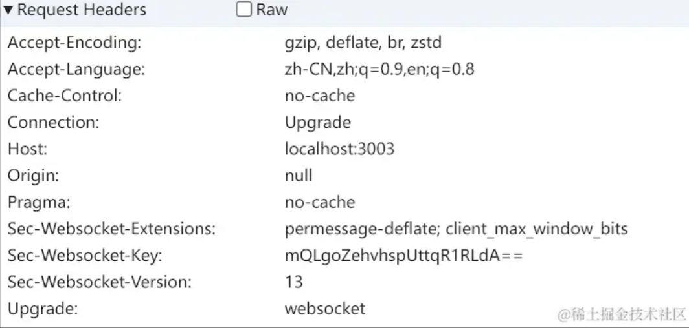
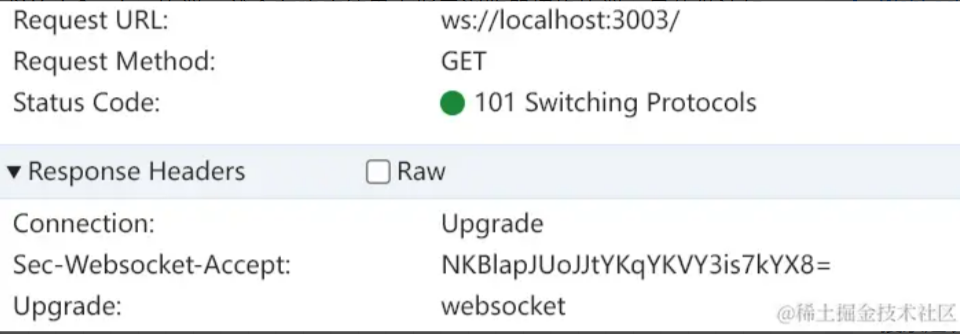

# NextJs

## NestJs是什么

NextJS是一款基于 React 进行 web 应用开发的框架，它以极快的应用体验而闻名，内置 Sass、Less、ES 等特性，开箱即用。SSR 只是 NextJS 的一种场景而已，它拥有4种渲染模式，我们需要为自己的应用选择正确的渲染模式：

+ Client Side Rendering (CSR)
客户端渲染，往往是一个 SPA(单页面应用)，HTML文件仅包含JS\CSS资源，不涉及页面内容，页面内容需要浏览器解析JS后二次渲染。
+ Static Site Generation (SSG)
静态页面生成，对于不需要频繁更新的静态页面内容，适合SSR，不依赖服务端。
+ Server Side Rendering (SSR)
服务端渲染，对于需要频繁更新的静态页面内容，更适合使用SSR，依赖服务端。
+ IncreIncremental Site Rendering (ISR)
增量静态生成，基于页面内容的缓存机制，仅对未缓存过的静态页面进行增量式生成，依赖服务端。

## NextJs的优缺点

### 优点：
1. 首屏加载速度快
我们的内嵌场景比较丰富，因此比较**追求页面的一个首屏体验**，NextJS 的产物类似 ` MPA（多页面应用）`，在请求页面时会对当前页面的资源进行按需加载,而不是去加载整个应用, 相对于 SPA 而言，可以实现更为极致的用户体验。
2. SEO优化好
SSR \ SSG \ ISR 支持页面内容预加载，提升了搜索引擎的友好性。
3. 内置特性易用且极致
NextJS 内置 getStaticProps、getServerSideProps、next/image、next/link、next/script等特性，充分利用该框架的这些特性，为你的用户提供更高层次的体验

### 缺点
1. 页面响应相对于SPA而言更慢
由于页面资源分页面按需加载，每次路由发生变化都需要加载新的资源，优化不够好的话，会导致页面卡顿。
2. 开发体验不够友好
开发环境下 NextJS 根据当前页面按需进行资源实时构建，影响开发及调试体验


## NextJs优化措施

+ 优化用户体验
  1. 开启 gzip 压缩
  2. 针对非首屏组件基于 `dynamic` 动态加载：
   在页面加载过程中，针对一些不可见组件，我们应该动态导入，而不是正常导入，确保只有需要该组件的场景下，才 `fetch` 对应资源, 通过 `next/dynamic`，在构建时，框架层面会帮我们进行分包
  3. `next/script` 优化 `script` 加载时： 
   `next/script` 可以帮助我们来决定 js 脚本加载的时机
  4. `next/image` 优化图片资源：
   `next/image` 可帮助我们**对图片进行压缩（尺寸 or 质量），且支持图片懒加载**，默认 `loader` 依赖 `nextjs` 内置服务，也可以通过`{loader: custom}`自定义loader
  5. next/link 预加载：
   基于 `hover` 识别用户意图，当用户 `hover` 到 `Link` 标签时，对即将跳转的页面资源进行预加载，进一步防止页面卡顿
  6. 静态内容预加载
   基于 `getStaticProps` 对不需要权限的内容进行预加载，它将在 NextJS 构建时被编译到页面中，`减少了 http 请求数量`
  7. 第三方 library 过大时，基于 `umd` 按需加载
   当第三方 library 过大时，以 `umd` 进行引入，在需要的场景下通过 `script` 进行加载。


# Websocket

## 连接建立过程

1. 建立TCP连接
2. 在建立TCP连接之后，浏览器会先通过HTTP请求来告知服务器进行协议升级，具体的做法是在带上一些特殊的请求头：
   
   + `Connection: Upgrade`用于告知服务器进行协议升级
   + `Upgrade: websocket`用于告知想要升级的协议是Websocket
   + `Set-Websocket-Key`是一段随机生成的base64码，用于服务器返回响应结果时验证
3. 服务器如果支持升级成WebSocket协议，就会在响应结果中指示浏览器切换协议，具体做法如下：
   
   + 根据客户端传递过来的`Set-Websocket-Key`用某个公开的算法变成另外一个字符串，放在HTTP响应的`Sec-Websocket-Accept`响应头中
   + 将响应状态码设置为`101`
   + 此时，浏览器收到服务器的响应结果之后，会同样使用公开算法将之前发送的`Set-Websocket-Key`转成另外一个字符串，与服务器返回的`Sec-Websocket-Accept`进行比较，如果一致的话就验证通过
   + 至此握手完成，WebSocket连接建立，之后就可以使用WebSocket进行通信了


# React Playground

## 实现思路

- 编译用的`@babel/standalone`，这个是babel的浏览器版本

- 关于文件中 import 导入 文件问题

   - 思路：
     - 1. 像vite 的dev server那样做一个根据 moduleId 返回编译后的模块内容的服务（但是这是一个纯前端的项目，所以不适合）
     - 使用blob url：将要导入的文件转化为一个blob url，然后替换import 的路径，达到浏览器能运行的目的
- 还有就是 react 和 react-dom 包问题，它不是左侧的代码文件，那么如何实现引入问题？
   - 思路：
     - 利用 import-maps 机制，使用 [esm.sh] 专门提供 esm 模块的CDN服务 

### 如何替换import的路径？

编写一个babel 插件 在babel 的transform阶段，对ImportDeclaration 的AST做处理，把 source.value 替换为对应文件的 blob url ————babel 的编译流程、AST的构成

### 编译器部分

用的@monaco-editor/react 周下载量 82万

monaco editor 还是 VS Code 的编译器核心，功能十分强大，提供了丰富的代码提示、错误检测、API查找等功能，使体验十分接近 VS Code

还可以设置TS的compilerOptions

其他考虑的库是 CodeMirror、React SimpleMDE、React Quill等

- 拖动改变代码区和预览区的宽度：使用 allotment第三方组件

- 引入第三方包或者写TS支持代码提示：使用 @typescript/ata 包
用 ts 包去分析代码，然后自动下载用到的类型包，编辑器挂载的时候调用一下，实现代码改变时自动下载 dts 类型包的功能

### 多文件切换
使用 Context 保存数据

context 在传递跨层数据方面很好用，在组件库中使用很多，但是有一些性能上的缺点：
- context 如果是一个对象，传递多个属性的数据，不管任意属性变了，都会导致依赖其他属性的组件跟着重新渲染，这时候的解决方案就是拆分 context，每种数据放在独立的一个context中
- 但是会出现一个问题：Provider嵌套过深。所以context存放一些配置数据还好，例如theme，size等，如果有很多业务数据，就需要使用 redux、zustand、jotai 等状态管理库，它们不是基于context实现的，就不会出现这些问题
- 用 memo 包裹子组件

### 预览部分

使用 iframe + 通信机制

左边编译的结果传给 iframe 渲染

编写插件处理import 语句，转换成blob url的形式，将文件内容转成对应的url

#### **文件的处理规则：**
- ts文件的处理就是用 babel 编译下，然后用 URL.createObjectURL 把编译后的文件内容作为 url。
```js
URL.creactObjectURL(new Blob([文件内容], {type: 'application/javascript'}))
```
- json 文件的处理比较简单，就是把 export 一下这个 json，然后作为 blob url。
```js
const js = `export default ${file.value}`
return URL.createObjectURL(new Blob([js], { type: 'application/javascript' }))
```
-  css 文件，则是要通过 js 代码把它添加到 head 里的 style 标签里：
```js
const js = `
(() => {
    const stylesheet = document.createElement('style')
    stylesheet.setAttribute('id', 'style_${randomId}_${file.name}')
    document.head.appendChild(stylesheet)

    const styles = document.createTextNode(\`${file.value}\`)
    stylesheet.innerHTML = ''
    stylesheet.appendChild(styles)
})()
    `
return URL.createObjectURL(new Blob([js], { type: 'application/javascript' }))
```

#### **babel 编译**
插件写好后就开始写babel的编译，调用 babel 的 transform 方法进行编译，指定 react 和 typescript，也就是对 jsx 和 ts 语法做处理，并把插件加载一下,运行之后就得到了可以在浏览器上运行的blob url

> 注意 jsx 文件经过babel编译之后会变成 React.createElement,如果文件没有引入React，这样运行会报错，需要做处理：
在babel 编译之前，判断下文件内容有没有 import React，没有就 import 一下，来实现自动引入
```js
export const beforeTransformCode = (filename: string, code: string) => {
    let _code = code
    const regexReact = /import\s+React/g
    if ((filename.endsWith('.jsx') || filename.endsWith('.tsx')) && !regexReact.test(code)) {
      _code = `import React from 'react';\n${code}`
    }
    return _code
}
```

### 错误显示

预览出错的时候，iframe 会白屏，并不会显示错误。但是在devtools可以看到错误信息，需要做这些信息的展示

错误的内容从iframe 传出，在iframe中监听错误，通过 postMessage 传递消息给父窗口（这也是一种跨域的手段）
```js
window.addEventListener('error', (e) => {
   window.parent.postMessage({type: 'ERROR', message: e.message})
})
```
父窗口预览组件中监听消息：
```js
useEffect(() => {
   window.addEventListener('message', handleMessage)
   return () => {
      window.removeEventListener('message', handleMessage)
   }
}, [])
```


### 链接分享

链接分享原理是将files信息 JSON.stringfy 成字符串，对字符串 `encodeURIComponent` 下，把 url 里不支持的字符做下转换之后保存到 location.hash
```js
useEffect(() => {
    const hash = JSON.stringify(files)
    window.location.hash = encodeURIComponent(hash)
}, [files])
```
然后初始化的时候是从 location.hash 读取出来 JSON.parse 之后设置到 files
```js
const getFilesFromUrl = () => {
  let files: Files | undefined
  try {
      const hash = decodeURIComponent(window.location.hash.slice(1))
      files = JSON.parse(hash)
  } catch (error) {
    console.error(error)
  }
  return files
}
```
但是文件内容组成的hash非常长，需要做下压缩，用 fflate 这个包来对字符串进行压缩，然后用 btoa 转为 asc 码字符串。

将链接复制到剪切板：
使用copy-to-clipboard库

### 文件下载

把多个文件压缩成zip包 jszip
触发文件下载 file-saver

## 性能优化

### 查看性能

查看 Performance 录制的性能数据，发现代表babel编译的babelTransform方法十分耗时，是一个long task

long task 会导致主线程一直被占据，阻塞渲染，表现出来的就是页面卡顿。

性能优化的目标就是消除这种 long task。

分析这段代码发现，这是 babel 内部代码，这段代码计算量比较大，我们把它放到单独的 worker 线程来跑就好了，这样就不会占用主线程的时间。

### web worker使用

查看 vite 官方文档，里面有vite 项目 web worker 的使用方法

使用postMessage 和监听message 事件进行主线程和worker线程的通信：

主线程这边给 worker 线程传递 files，然后拿到 woker 线程传回来的编译后的代码，而 worker 线程这边则是监听主线程的 message，传递 files 编译后的代码给主线程

### 其他优化
而且每次 files 变化没必要频繁的触发编译，加一个防抖优化一下

main.tsx 编译器报错说 StrictMode 不是一个jsx，因为不影响运行，所以没有解决这个，可以自己改动模版，将其删去即可